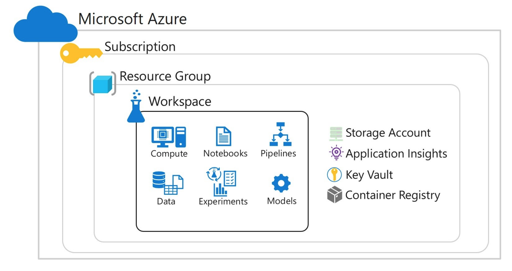
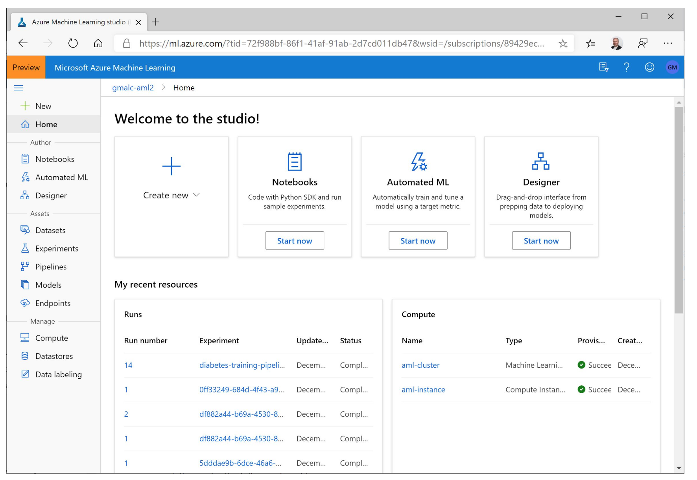
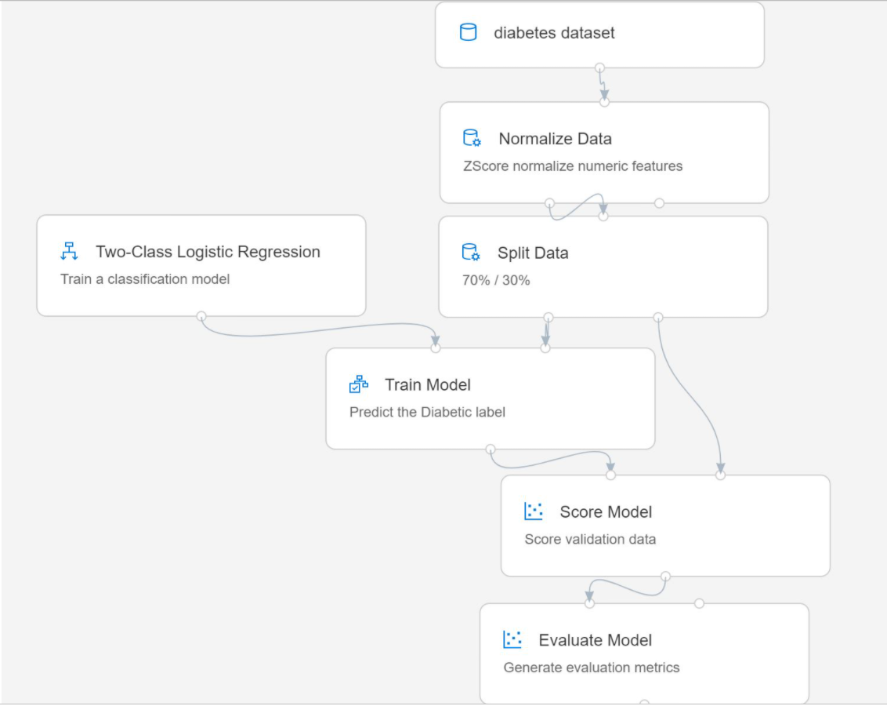
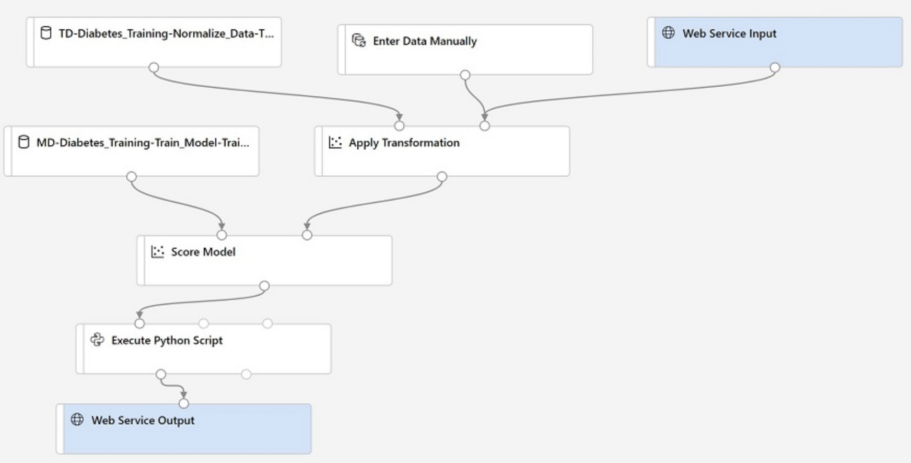

# Summary for Azure DP100 Exam

Resources: 
- https://github.com/MicrosoftLearning/DP100/tree/master/labdocs
- https://docs.microsoft.com/en-us/learn/certifications/exams/dp-100
- https://www.itexams.com/exam/DP-100
- https://docs.microsoft.com/en-us/azure/machine-learning/

## 1 Set up an Azure Machine Learning Workspace (30-35%)
### 1.1 Create an Azure Machine Learning workspace
A workspace defines the boundary for a set of related machine learning assets. You can use workspaces to group machine learning assets based on projects, deployment environments (for example, test and production), teams, or some other organizing principle. The assets in a workspace include:

* Compute targets for development, training, and deployment.
* Data for experimentation and model training.
* Notebooks containing shared code and documentation.
* Experiments, including run history with logged metrics and outputs.
* Pipelines that define orchestrated multi-step processes.
* Models that you have trained.
* Workspaces as Azure Resources

Workspaces are Azure resources, and as such they are defined within a resource group in an Azure subscription, along with other related Azure resources that are required to support the workspace.


The Azure resources created alongside a workspace include:
* A storage account - used to store files used by the workspace as well as data for experiments and model training.
* An Application Insights instance, used to monitor predictive services in the workspace.
* An Azure Key Vault instance, used to manage secrets such as authentication keys and credentials used by the workspace.
* A container registry, created as-needed to manage containers for deployed models.

#### 1.1.1 create an Azure Machine Learning workspace 
Reference: https://docs.microsoft.com/en-us/learn/modules/intro-to-azure-machine-learning-service/2-azure-ml-workspace

You can create a workspace in any of the following ways:

* In the Microsoft Azure portal, create a new Machine Learning resource, specifying the subscription, resource group and workspace name.
* Use the Azure Machine Learning Python SDK to run code that creates a workspace. For example, the following code creates a workspace named aml-workspace (assuming the Azure ML SDK for Python is installed and a valid subscription ID is specified):

```python
    from azureml.core import Workspace
    
    ws = Workspace.create(name='aml-workspace', 
                      subscription_id='123456-abc-123...',
                      resource_group='aml-resources',
                      create_resource_group=True,
                      location='eastus'
                     )
 ```

Use the Azure Command Line Interface (CLI) with the Azure Machine Learning CLI extension. For example, you could use the following command (which assumes a resource group named aml-resources has already been created):
```bash
    az ml workspace create -w 'aml-workspace' -g 'aml-resources'
```

Create an Azure Resource Manager template, see [ARM documentation](https://docs.microsoft.com/en-us/azure/machine-learning/how-to-create-workspace-template?tabs=azcli).

**NOTE**
*Basic* edition as opposed to *Enterprise* edition of the workspace have lower cost, but do not include capabilities like AutoML, the Visual Designer, and data drift monitoring. See also https://azure.microsoft.com/en-us/pricing/details/machine-learning/.

#### 1.1.2 configure workspace settings
fter installing the SDK package in your Python environment, you can write code to connect to your workspace and perform machine learning operations. The easiest way to connect to a workspace is to use a workspace configuration file, which includes the Azure subscription, resource group, and workspace details as shown here:

```json
{
    "subscription_id": "1234567-abcde-890-fgh...",
    "resource_group": "aml-resources",
    "workspace_name": "aml-workspace"
}
```

Tip: You can download a configuration file for a workspace from the Overview page of its blade in the Azure portal or from Azure Machine Learning studio.

To connect to the workspace using the configuration file, you can use the from_config method of the Workspace class in the SDK, as shown here:

```python
from azureml.core import Workspace

ws = Workspace.from_config()
```

By default, the `from_config` method looks for a file named `config.json` in the folder containing the Python code file, but you can specify another path if necessary.

As an alternative to using a configuration file, you can use the get method of the Workspace class with explicitly specified subscription, resource group, and workspace details as shown here - though the configuration file technique is generally preferred due to its greater flexibility when using multiple scripts:

```python
from azureml.core import Workspace

ws = Workspace.get(name='aml-workspace',
                   subscription_id='1234567-abcde-890-fgh...',
                   resource_group='aml-resources')
```
Whichever technique you use, if there is no current active session with your Azure subscription, you will be prompted to authenticate.

#### 1.1.3 manage a workspace by using Azure Machine Learning studio
You can manage the assets in your Azure Machine Learning workspace in the Azure portal, but as this is a general interface for managing all kinds of resources in Azure, data scientists and other users involved in machine learning operations may prefer to use a more focused, dedicated interface.



Azure Machine Learning studio is a web-based tool for managing an Azure Machine Learning workspace. It enables you to create, manage, and view all of the assets in your workspace and provides the following graphical tools:

Designer: A drag and drop interface for "no code" machine learning model development.
Automated Machine Learning: A wizard interface that enables you to train a model using a combination of algorithms and data preprocessing techniques to find the best model for your data.
 Note

A previously released tool named Azure Machine Learning Studio provided a free service for drag and drop machine learning model development. The studio interface for the Azure Machine Learning service includes this capability in the designer tool, as well as other workspace asset management capabilities.

To use Azure Machine Learning studio, use a a web browser to navigate to https://ml.azure.com and sign in using credentials associated with your Azure subscription. You can then select the subscription and workspace you want to manage.

### 1.2 Manage data objects in an Azure Machine Learning workspace
#### 1.2.1 register and maintain data stores
In Azure Machine Learning, datastores are abstractions for cloud data sources. They encapsulate the information required to connect to data sources, and can be used to ingest data into an experiment or to write outputs from an experiment.

**Types of Datastore**

Azure Machine Learning supports the following types of datastores (non-exhaustive):
* Azure Storage (blob and file containers)
* Azure Data Lake stores
* Azure SQL Database
* Azure Databricks file system (DBFS)

*> Note:* For a full list of supported datastores, see https://docs.microsoft.com/en-us/azure/machine-learning/concept-data#access-data-in-storage.

**Using Datastores**

You can access datastores directly in code by using the Azure Machine Learning SDK, and use it to upload or download data. You can also mount a datastore in an experiment in order to read or write data.

The ability to define a datastore enables you to reuse data across multiple experiments, regardless of the compute context in which the experiment is running.

**Adding Datastores to a Workspace**

Every workspace has two built-in datastores (an Azure Storage blob container, and an Azure Storage file container) that are used as system storage by Azure Machine Learning. You can also store a limited amount of your own data in these built-in datastores for experiments, model training, and so on.

However, in most machine learning projects, you will likely need to work with data sources of your own - either because you need to store larger volumes of data than the built-in datastores support, or because you need to integrate your machine learning solution with data from existing applications.

*Registering a Datastore*

To add a datastore to your workspace, you can register it using the graphical interface in Azure Machine Learning Studio, or you can use the Azure Machine Learning SDK. For example, the following code registers an Azure Storage blob container as a datastore named blob_data.
```python
from azureml.core import Workspace, Datastore
ws = Workspace.from_config()

# Register a new datastore
blob_ds = Datastore.register_azure_blob_container(
workspace=ws, datastore_name='blob_data',
container_name='data_container',
account_name='az_store_acct',
account_key='123456abcde789…')
 ``` 

*Managing Datastores*

You can view and manage datastores in Azure Machine Learning Studio, or you can use the Azure Machine Learning SDK. For example, the following code lists the names of each datastore in the workspace.
```python
for ds_name in ws.datastores:
    print(ds_name)
``` 
You can get a reference to any datastore by using the Datastore.get() method as shown here:
```python
blob_store = Datastore.get(ws, datastore_name='blob_data')
``` 
The workspace always includes a default datastore (initially, this is the built-in workspaceblobstore datastore), which you can retrieve by using the get_default_datastore() method of a Workspace object, like this:
```python
default_store = ws.get_default_datastore()
``` 
To change the default datastore, use the set_default_datastore() method:
```python
ws.set_default_datastore('blob_data')
``` 

**Using Azure Blob and File Datastores**

Azure blob and file datastores are the most commonly used. You can use the Azure Machine Learning SDK to work directly with these datastores, and to pass data references to scripts that need to access data.

*Working Directly with a Datastore*

You can work directly with a datastore to upload and download data by using the methods of the datastore class, like this:
```python
blob_ds.upload(src_dir='/files',
               target_path='/data/files',
               overwrite=True, show_progress=True)

blob_ds.download(target_path='downloads',
                 prefix='/data',
                 show_progress=True)
``` 

*Using Data References*

When you want to use a datastore in an experiment script, you must pass a data reference to the script. The data reference is configured for one of the following data access modes:
* **Download**: The contents of the path associated with the data reference is downloaded to the compute context where the experiment is running.
* **Upload**: The files generated by your experiment script are uploaded to the datastore after the run completes.
* **Mount**: The path on the datastore is mounted as remote storage in the experiment compute context, enabling the contents to be accessed remotely (note that this mode is only available when the experiment is run on a remote compute target - you cannot use this mode with local compute).

To pass the data reference to an experiment script, you must define a script parameter as shown here:
```python
data_ref = blob_ds.path('data/files').as_download(
path_on_compute='training_data'
)
estimator = SKLearn(source_directory='experiment_folder',
                    entry_script='training_script.py'
                    compute_target='local',
                    script_params = {'--data_folder': data_ref})
``` 
In your training script, you can retrieve the parameter and use it like a local folder:
```python
import os
import argparse

parser = argparse.ArgumentParser()
parser.add_argument('--data_folder', type=str, dest='data_folder')
args = parser.parse_args()
data_files = os.listdir(args.data_folder)
``` 
#### 1.2.2 create and manage datasets

**Azure portal**
1. In the *Studio* interface, view the **Datasets** page. Datasets represent specific data files or tables that you plan to work with in Azure ML.
2. Create a new dataset from web files, using the following settings:
    * **Basic Info**:
        * **Web URL**: https://aka.ms/diabetes-data
        * **Name**: diabetes dataset (*be careful to match the case and spacing*)
        * **Dataset type**: Tabular
        * **Description**: Diabetes data
    * **Settings and preview**:
        * **File format**: Delimited
        * **Delimiter**: Comma
        * **Encoding**: UTF-8
        * **Column headers**: Use headers from first file
        * **Skip rows**: None
    * **Schema**:
        * Include all columns other than **Path**
        * Review the automatically detected types
    * **Confirm details**:
        * Do not profile the dataset after creation
3. After the dataset has been created, open it and view the **Explore** page to see a sample of the data. This data represents details from patients who have been tested for diabetes, and you will use it in many of the subsequent labs in this course.

    > **Note**: You can optionally generate a *profile* of the dataset to see more details. You'll explore datasets in more detail later in the course.
    
Datasets are versioned packaged data objects that can be easily consumed in experiments and pipelines. Datasets are the recommended way to work with data, and are the primary mechanism for advanced Azure Machine Learning capabilities like data labeling and data drift monitoring.

**Types of Dataset**

Datasets are typically based on files in a datastore, though they can also be based on URLs and other sources. You can create the following types of dataset:

* Tabular: The data is read from the dataset as a table. You should use this type of dataset when your data is consistently structured and you want to work with it in common tabular data structures, such as Pandas dataframes.

* File: The dataset presents a list of file paths that can be read as though from the file system. Use this type of dataset when your data is unstructured, or when you need to process the data at the file level (for example, to train a convolutional neural network from a set of image files).

You can create datasets from individual files or multiple file paths. The paths can include wildcards (for example, /files/*.csv) making it possible to encapsulate data from a large number of files in a single dataset.

You can create a dataset and work with it immediately, and you can then register the dataset in the workspace to make it available for use in experiments and data processing pipelines later.

You can create datasets by using the visual interface in Azure Machine Learning studio, or you can use the Azure Machine Learning SDK.

**Creating and Registering Tabular Datasets**

To create a tabular dataset using the SDK, use the from_delimited_files method of the Dataset.Tabular class, like this:
```python
from azureml.core import Dataset
blob_ds = ws.get_default_datastore()
csv_paths = [(blob_ds, 'data/files/current_data.csv'),
             (blob_ds, 'data/files/archive/*.csv')]
tab_ds = Dataset.Tabular.from_delimited_files(path=csv_paths)
tab_ds = tab_ds.register(workspace=ws, name='csv_table')
``` 

The dataset in this example includes data from two file paths within the default datastore:
* The *current_data.csv* file in the *data/files* folder.
* All *.csv* files in the *data/files/archive/* folder.

After creating the dataset, the code registers it in the workspace with the name *csv_table*.

**Creating and Registering File Datasets**

To create a file dataset using the SDK, use the from_files method of the Dataset.File class, like this:
```python
from azureml.core import Dataset
blob_ds = ws.get_default_datastore()
file_ds = Dataset.File.from_files(path=(blob_ds, 
                                        'data/files/images/*.jpg'))
file_ds = file_ds.register(workspace=ws, name='img_files')
``` 

The dataset in this example includes all *.jpg* files in the *data/files/images* path within the default datastore:

After creating the dataset, the code registers it in the workspace with the name *img_files*.

**Retrieving a Registered Dataset**

After registering a dataset, you can retrieve it by using any of the following techniques:
* The datasets dictionary attribute of a Workspace object.
* The *get_by_name* or *get_by_id* method of the Dataset class.

Both of these techniques are shown in the following code:
```python
import azureml.core
from azureml.core import Workspace, Dataset
# Load the workspace from the saved config file
ws = Workspace.from_config()
# Get a dataset from the workspace datasets collection
ds1 = ws.datasets['csv_table']
# Get a dataset by name from the datasets class
ds2 = Datasets.get_by_name(ws, 'img_files')
# Get the files in the dataset
for file_path in ds2.to_path():
   print(file_path)
``` 

### 1.3 Manage experiment compute contexts
#### 1.3.1 create a compute instance
1. In the Azure Machine Learning studio web interface for your workspace, view the **Compute** page. This is where you'll manage all the compute targets for your data science activities.
2. On the **Compute Instances** tab, add a new compute instance with the following settings. You'll use this as a workstation from which to test your model:
    - **Compute name**: *enter a unique name*
    - **Virtual Machine type**: CPU
    - **Virtual Machine size**: Standard_DS1_v2
3. While the compute instance is being created, switch to the **Compute Clusters** tab, and add a new compute cluster with the following settings. You'll use this to train a machine learning model:
    - **Compute name**: *enter a unique name*
    - **Virtual Machine type**: CPU
    - **Virtual Machine priority**: Dedicated
    - **Virtual Machine size**: Standard_DS2_v2
    - **Minimum number of nodes**: 0
    - **Maximum number of nodes**: 2
    - **Idle seconds before scale down**: 120
4. Note the **Inference Clusters** tab. This is where you can create and manage compute targets on which to deploy your trained models as web services for client applications to consume.
5. Note the **Attached Compute** tab. This is where you could attach a virtual machine or Databricks cluster that exists outside of your workspace.
#### 1.3.2 determine appropriate compute specifications for a training workload
#### 1.3.3 create compute targets for experiments and training
The most common ways to create or attach a compute target are to use the Compute page in Azure Machine Learning studio, or to use the Azure Machine Learning SDK to provision compute targets in code. Additionally, you can create compute targets using the Azure Machine Learning extension in Visual Studio Code, or by using the Azure command line interface (CLI) extension for Azure Machine Learning.

**Creating a Managed Compute Target with the SDK**

A managed compute target is one that is managed by Azure Machine Learning, such as an Azure Machine Learning training cluster.

To create an Azure Machine Learning compute cluster compute target, use the `azureml.core.compute.ComputeTarget` class and the AmlCompute class, like this:
```python
from azureml.core import Workspace
from azureml.core.compute import ComputeTarget, AmlCompute

# Load the workspace from the saved config file
ws = Workspace.from_config()

# Specify a name for the compute (unique within the workspace)
compute_name = 'aml-cluster'

# Define compute configuration
compute_config = AmlCompute.provisioning_configuration(
vm_size='STANDARD_DS12_V2', min_nodes=0, max_nodes=4, 
vm_priority='dedicated')

# Create the compute
aml_cluster = ComputeTarget.create(ws, compute_name, compute_config)
aml_cluster.wait_for_completion(show_output=True)
``` 

In this example, a cluster with up to four nodes based on the STANDARD_DS12_v2 virtual machine image will be created. The priority for the virtual machines (VMs) is set to dedicated, meaning they are reserved for use in this cluster (the alternative is to specify lowpriority, which has a lower cost but means that the VMs can be pre-empted if a higher-priority workload requires the compute).

Note: For a full list of AmlCompute configuration options, see the AmlCompute class SDK documentation.

**Attaching an Unmanaged Compute Target with the SDK**

An unmanaged compute target is one that is defined and managed outside of the Azure Machine Learning workspace; for example, an Azure virtual machine or an Azure Databricks cluster.

The code to attach an existing unmanaged compute target is similar to the code used to create a managed compute target, except that you must use the `ComputeTarget.attach()` method to attach the existing compute based on its target-specific configuration settings.

For example, the following code can be used to attach an existing Azure Databricks cluster:
```python
from azureml.core import Workspace
from azureml.core.compute import ComputeTarget, DatabricksCompute

# Load the workspace from the saved config file
ws = Workspace.from_config()

# Specify a name for the compute (unique within the workspace)
compute_name = 'db_cluster'

# Define configuration for existing Azure Databricks cluster
db_workspace_name = 'db_workspace'
db_resource_group = 'db_resource_group'
db_access_token = '1234-abc-5678-defg-90...'
db_config = DatabricksCompute.attach_configuration(
resource_group=db_resource_group,
workspace_name=db_workspace_name,
access_token=db_access_token)

# Create the compute
databricks_compute = ComputeTarget.attach(ws, compute_name, db_config)
databricks_compute.wait_for_completion(True)
``` 
*Checking for an Existing Compute Target*

In many cases, you will want to check for the existence of a compute target, and only create a new one if there isn't already one with the specified name. To accomplish this, you can catch the ComputeTargetException exception, like this:
```python
from azureml.core.compute import ComputeTarget, AmlCompute
from azureml.core.compute_target import ComputeTargetException

compute_name = "aml-cluster"

# Check if the compute target exists
try:
    aml_cluster = ComputeTarget(workspace=ws, name=compute_name)
    print('Found existing cluster.')
except ComputeTargetException:
    # If not, create it
    compute_config = AmlCompute.provisioning_configuration(
    vm_size='STANDARD_DS12_V2', max_nodes=4)
    aml_cluster = ComputeTarget.create(ws, compute_name, compute_config)

aml_cluster.wait_for_completion(show_output=True)
``` 

More Information: For more information about creating compute targets, see Set up and use compute targets for model training in the Azure Machine Learning documentation.

**Using Compute Targets**

After you've created or attached compute targets in your workspace, you can use them to run specific workloads; such as experiments.

To use a particular compute target, you can specify it in the appropriate parameter for an experiment run configuration or estimator. For example, the following code configures an estimator to use the compute target named `aml-cluster`:
```python
from azureml.core import Environment
from azureml.train.estimator import Estimator

compute_name = 'aml-cluster'
training_env = Environment.get(workspace=ws, name='training_environment')
estimator = Estimator(source_directory='experiment_folder',
                      entry_script='training_script.py',
                      environment_definition=training_env,
                      compute_target=compute_name)
 ``` 

When an experiment for the estimator is submitted, the run will be queued while the aml-cluster compute target is started and the specified environment created on it, and then the run will be processed on the compute environment.

Instead of specifying the name of the compute target, you can specify a ComputeTarget object, like this:
```python
from azureml.core import Environment
from azureml.train.estimator import Estimator
from azureml.core.compute import ComputeTarget

compute_name = "aml-cluster"
training_cluster = ComputeTarget(workspace=ws, name=compute_name)
training_env = Environment.get(workspace=ws, name='training_environment')
estimator = Estimator(source_directory='experiment_folder',
                      entry_script='training_script.py',
                      environment_definition=training_env,
                      compute_target=training_cluster)
```

### --- Introduction Azure ML SDK --- ###
Azure Machine Learning (Azure ML) is a cloud-based service for creating and managing machine learning solutions. It's designed to help data scientists leverage their existing data processing and model development skills and frameworks, and help them scale their workloads to the cloud. The Azure ML SDK for Python provides classes you can use to work with Azure ML in your Azure subscription.

*Check the Azure ML SDK Version*

Let's start by importing the azureml-core package and checking the version of the SDK that is installed.

```python
import azureml.core
print("Ready to use Azure ML", azureml.core.VERSION)
```
View Azure ML resources
First connect to workspace, like so:
```python
from azureml.core import Workspace

ws = Workspace.from_config()
print(ws.name, "loaded")
```
and then view resources:
```python
from azureml.core import ComputeTarget, Datastore, Dataset

print("Compute Targets:")
for compute_name in ws.compute_targets:
    compute = ws.compute_targets[compute_name]
    print("\t", compute.name, ':', compute.type)
    
print("Datastores:")
for datastore_name in ws.datastores:
    datastore = Datastore.get(ws, datastore_name)
    print("\t", datastore.name, ':', datastore.datastore_type)
    
print("Datasets:")
for dataset_name in list(ws.datasets.keys()):
    dataset = Dataset.get_by_name(ws, dataset_name)
    print("\t", dataset.name)
```

## 2 Run Experiments and Train Models (25-30%)
### 2.1 Create models by using Azure Machine Learning Designer
#### 2.1.1 create a training pipeline by using Azure Machine Learning designer

With the data flow steps defined, you're now ready to run the training pipeline and train the model.

1. Verify that your pipeline looks similar to the following:

    

2. At the top right, click **Submit**. Then when prompted, create a new *experiment* named **visual-training**, and run it.  This will initialize the compute cluster and then run the pipeline, which may take 10 minutes or longer. You  can see the status of the pipeline run above the top right of the design canvas.

    **Tip**: While it's running, you can view the pipeline and experiment that have been created in the **Pipelines** and **Experiments** pages. Switch back to the **Visual Diabetes Training** pipeline on the **Designer** page when you're done.

3. After the **Normalize Data** module has completed, select it, and in the **Settings** pane, on the **Outputs + logs** tab, under **Data outputs** in the **Transformed dataset** section, click the **Visualize** icon, and note that you can view statistics and distribution visualizations for the transformed columns.
4. Close the **Normalize Data** visualizations and wait for the rest of the modules to complete. Then visualize the output of the **Evaluate Model** module to see the performance metrics for the model.

    **Note**: The performance of this model isn't all that great, partly because we performed only minimal feature engineering and pre-processing. You could try some different classification algorithms and compare the results (you can connect the outputs of the **Split Data** module to multiple **Train Model** and **Score Model** modules, and you can connect a second scored model to the **Evaluate Model** module to see a side-by-side comparison). The point of the exercise is simply to introduce you to the Designer interface, not to train a perfect model!

#### 1.2.2 ingest data in a designer pipeline
#### 1.2.3 use designer modules to define a pipeline data flow
#### 1.2.4 use custom code modules in designer

### 2.2 Run training scripts in an Azure Machine Learning workspace
#### 2.2.1 create and run an experiment by using the Azure Machine Learning SDK
In Azure Machine Learning, an experiment is a named process, usually the running of a script or a pipeline, that can generate metrics and outputs and be tracked in the Azure Machine Learning workspace. An experiment can be run multiple times, with different data, code, or settings; and Azure Machine Learning tracks each run, enabling you to view run history and compare results for each run.

**The Experiment Run Context**

When you submit an experiment, you use its run context to initialize and end the experiment run that is tracked in Azure Machine Learning, as shown in the following code sample:
```python
from azureml.core import Experiment

# create an experiment variable
experiment = Experiment(workspace = ws, name = "my-experiment")

# start the experiment
run = experiment.start_logging()

# experiment code goes here

# end the experiment
run.complete()
```
After the experiment run has completed, you can view the details of the run in the Experiments tab in Azure Machine Learning studio.

**Via Script**
```python
%%writefile $folder_name/diabetes_experiment.py
from azureml.core import Run
import pandas as pd
import os

# Get the experiment run context
run = Run.get_context()

# load the diabetes dataset
data = pd.read_csv('diabetes.csv')

# Count the rows and log the result
row_count = (len(data))
run.log('observations', row_count)
print('Analyzing {} rows of data'.format(row_count))

# Count and log the label counts
diabetic_counts = data['Diabetic'].value_counts()
print(diabetic_counts)
for k, v in diabetic_counts.items():
    run.log('Label:' + str(k), v)
      
# Save a sample of the data in the outputs folder 
# (which gets uploaded automatically)
os.makedirs('outputs', exist_ok=True)
data.sample(100).to_csv("outputs/sample.csv", index=False, header=True)

# Complete the run
run.complete()
``` 

This code is a simplified version of the inline code used before. However, note the following:

It uses the `Run.get_context()` method to retrieve the experiment run context when the script is run.
It loads the diabetes data from the folder where the script is located.
It creates a folder named outputs and writes the sample file to it - this folder is automatically uploaded to the experiment run
Now you're almost ready to run the experiment. To run the script, you must create a `ScriptRunConfig` that identifies the Python script file to be run in the experiment, and then run an experiment based on it.

Note: The `ScriptRunConfig` also determines the compute target and Python environment. If you don't specify these, a default environment is created automatically on the local compute where the code is being run (in this case, where this notebook is being run).

The following cell configures and submits the script-based experiment:
```python
import os
import sys
from azureml.core import Experiment, ScriptRunConfig
from azureml.widgets import RunDetails


# Create a script config
script_config = ScriptRunConfig(source_directory=experiment_folder, 
                                script='diabetes_experiment.py') 

# submit the experiment
experiment = Experiment(workspace=ws, name='diabetes-experiment')
run = experiment.submit(config=script_config)
RunDetails(run).show()
run.wait_for_completion()
```

**View experiment run history**
```python
from azureml.core import Experiment, Run

diabetes_experiment = ws.experiments['diabetes-experiment']
for logged_run in diabetes_experiment.get_runs():
    print('Run ID:', logged_run.id)
    metrics = logged_run.get_metrics()
    for key in metrics.keys():
        print('-', key, metrics.get(key))
```

#### 2.2.2 consume data from a data store in an experiment by using the Azure Machine Learning SDK

Working with Datastores
Although it's fairly common for data scientists to work with data on their local file system, in an enterprise environment it can be more effective to store the data in a central location where multiple data scientists can access it. In this lab, you'll store data in the cloud, and use an Azure Machine Learning datastore to access it.
```python
# Connect to Your Workspace
import azureml.core
from azureml.core import Workspace
ws = Workspace.from_config()
print('Ready to use Azure ML {} to work with {}'.format(azureml.core.VERSION, ws.name))

# View Datastores in the Workspace
from azureml.core import Datastore
default_ds = ws.get_default_datastore() # get default datastore

for ds_name in ws.datastores: 
# enumerate all datastores, indicating which is the default
    print(ds_name, "- Default =", ds_name == default_ds.name)

# Get a Datastore to Work With
aml_datastore = Datastore.get(ws, 'aml_data')
print(aml_datastore.name,":", 
aml_datastore.datastore_type + " (" + aml_datastore.account_name + ")")

# Set the Default Datastore (for convenience)
ws.set_default_datastore('aml_data')
default_ds = ws.get_default_datastore()
print(default_ds.name)

# Upload Data to a Datastore
default_ds.upload_files( # Upload the diabetes csv files in /data
files=['./data/diabetes.csv', './data/diabetes2.csv'], 
target_path='diabetes-data/', # Put it in a folder path in the datastore
overwrite=True, # Replace existing files of the same name
show_progress=True)                     
``` 

#### 2.2.3 consume data from a dataset in an experiment by using the Azure Machine Learning SDK
You can read data directly from a dataset, or you can pass a dataset as a named input to a script configuration or estimator.
If you have a reference to a dataset, you can access its contents directly.

For tabular datasets, most data processing begins by reading the dataset as a Pandas dataframe:
```python
df = tab_ds.to_pandas_dataframe()
# code to work with dataframe goes here
``` 

When working with a file dataset, you can use the to_path() method to return a list of the file paths encapsulated by the dataset:
```python
for file_path in file_ds.to_path():
    print(file_path)
``` 

**Passing a Dataset to an Experiment Script**
When you need to access a dataset in an experiment script, you can pass the dataset as an input to a ScriptRunConfig or an Estimator. For example, the following code passes a tabular dataset to an estimator:
```python 
estimator = SKLearn( source_directory='experiment_folder',
                     entry_script='training_script.py'
                     compute_target='local',
                     inputs=[tab_ds.as_named_input('csv_data')],
                     pip_packages=['azureml-dataprep[pandas]')
```
**> Note **: since the script will need to work with a Dataset object, you must include either the full azureml-sdk package or the azureml-dataprep package with the pandas extra library in the script's compute environment.

In the experiment script itself, you can access the input and work with the Dataset object it references like this:
```python
run = Run.get_context()
data = run.input_datasets['csv_data'].to_pandas_dataframe()
``` 

When passing a file dataset, you must specify the access mode. For example:
```python
estimator = Estimator( source_directory='experiment_folder',
                     entry_script='training_script.py',
                     compute_target='local',
                     inputs=[img_ds.as_named_input('img_data').as_download(path_on_compute='data')],
                     pip_packages=['azureml-dataprep[pandas]')
``` 
When a file dataset is passed to the estimator, a mount point from which the script can read the files has to be defined:
- for large volumes of data, you would generally use the *as_mount* method to stream the files directly from the dataset source
- When running on local compute though, you need to use the *as_download* option to download the dataset files to a local folder.

**Dataset Versioning**

Datasets can be versioned, enabling you to track historical versions of datasets that were used in experiments, and reproduce those experiments with data in the same state.

*Creating a New Version of a Dataset*

You can create a new version of a dataset by registering it with the same name as a previously registered dataset and specifying the create_new_version property:
```python 
img_paths = [(blob_ds, 'data/files/images/*.jpg'),
             (blob_ds, 'data/files/images/*.png')]
file_ds = Dataset.File.from_files(path=img_paths)
file_ds = file_ds.register(
workspace=ws, name='img_files', 
create_new_version=True
)
``` 

In this example, the .png files in the images folder have been added to the definition of the `img_paths` dataset example used in the previous topic.

*Retrieving a Specific Dataset version*

You can retrieve a specific version of a dataset by specifying the version parameter in the `get_by_name` method of the Dataset class.
```python 
img_ds = Dataset.get_by_name(workspace=ws, name='img_files', version=2)
``` 

#### 2.2.4 choose an estimator for a training experiment
```python
%%writefile $training_folder/diabetes_training.py
# Import libraries
from azureml.core import Run
import pandas as pd
import numpy as np
import joblib
import os
from sklearn.model_selection import train_test_split
from sklearn.linear_model import LogisticRegression
from sklearn.metrics import roc_auc_score
from sklearn.metrics import roc_curve

# Get the experiment run context
run = Run.get_context()

# load the diabetes dataset
print("Loading Data...")
diabetes = pd.read_csv('diabetes.csv')

# Separate features and labels
X, y = diabetes[['Pregnancies','PlasmaGlucose','DiastolicBloodPressure',
                 'TricepsThickness','SerumInsulin','BMI', 'DiabetesPedigree',
                 'Age']].values, diabetes['Diabetic'].values

# Split data into training set and test set
X_train, X_test, y_train, y_test = train_test_split(X, y, 
                                                    test_size=0.30, 
                                                    random_state=0)

# Set regularization hyperparameter
reg = 0.01

# Train a logistic regression model
print('Training a logistic regression model with regularization rate of', reg)
run.log('Regularization Rate',  np.float(reg))
model = LogisticRegression(C=1/reg, solver="liblinear").fit(X_train, 
                                                            y_train)

# calculate accuracy
y_hat = model.predict(X_test)
acc = np.average(y_hat == y_test)
print('Accuracy:', acc)
run.log('Accuracy', np.float(acc))

# calculate AUC
y_scores = model.predict_proba(X_test)
auc = roc_auc_score(y_test,y_scores[:,1])
print('AUC: ' + str(auc))
run.log('AUC', np.float(auc))

# Save the trained model in the outputs folder
os.makedirs('outputs', exist_ok=True)
joblib.dump(value=model, filename='outputs/diabetes_model.pkl')

run.complete()
``` 

```python
from azureml.train.estimator import Estimator
from azureml.core import Experiment

# Create an estimator
estimator = Estimator(source_directory=training_folder,
                      entry_script='diabetes_training.py',
                      compute_target='local',
                      conda_packages=['scikit-learn']
                      )

# Create an experiment
experiment_name = 'diabetes-training'
experiment = Experiment(workspace = ws, name = experiment_name)

# Run the experiment based on the estimator
run = experiment.submit(config=estimator)
run.wait_for_completion(show_output=True)
``` 

**Use a Framework-Specific Estimator**

You used a generic Estimator class to run the training script, but you can also take advantage of framework-specific estimators that include environment definitions for common machine learning frameworks. In this case, you're using Scikit-Learn, so you can use the SKLearn estimator. This means that you don't need to specify the scikit-learn package in the configuration.
```python
from azureml.train.sklearn import SKLearn
from azureml.widgets import RunDetails

# Create an estimator
estimator = SKLearn(source_directory=training_folder,
                    entry_script='diabetes_training.py',
                    script_params = {'--reg_rate': 0.1},
                    compute_target='local'
                    )

# Create an experiment
experiment_name = 'diabetes-training'
experiment = Experiment(workspace = ws, name = experiment_name)

# Run the experiment
run = experiment.submit(config=estimator)

# Show the run details while running
RunDetails(run).show()
run.wait_for_completion()
```
### 2.3 Generate metrics from an experiment run
#### 2.3.1 log metrics from an experiment run
Every experiment generates log files that include the messages that would be written to the terminal during interactive execution. This enables you to use simple print statements to write messages to the log. However, if you want to record named metrics for comparison across runs, you can do so by using the Run object; which provides a range of logging functions specifically for this purpose. These include:

* **log**: Record a single named value.
Example experiment code:
```python
import pandas
data = pd.read_csv('data/diabetes.csv')
row_count = len(data)
run.log('observations', row_count)
```
* **log_list**: Record a named list of values.
```python
run.log_list('pregnancy categories', data.Pregnancies.unique())
```  
* **log_row**: Record a row with multiple columns.
```python
# Log summary statistics for numeric columns
med_columns = ['PlasmaGlucose', 'DiastolicBloodPressure', 
              'TricepsThickness', 'SerumInsulin', 'BMI']
summary_stats = data[med_columns].describe().to_dict()
for col in summary_stats:
    keys = list(summary_stats[col].keys())
    values = list(summary_stats[col].values())
    for index in range(len(keys)):
        run.log_row(col, stat=keys[index], value = values[index])
```
* **log_table**: Record a dictionary as a table.
* **log_image**: Record an image file or a plot.
```python
diabetic_counts = data['Diabetic'].value_counts()
fig = plt.figure(figsize=(6,6))
ax = fig.gca()    
diabetic_counts.plot.bar(ax = ax) 
ax.set_title('Patients with Diabetes') 
ax.set_xlabel('Diagnosis') 
ax.set_ylabel('Patients')
plt.show()
run.log_image(name = 'label distribution', plot = fig)
```

More Information: For more information about logging metrics during experiment runs, see https://docs.microsoft.com/en-us/azure/machine-learning/how-to-track-experiments.

For example, following code records the number of observations (records) in a CSV file:
```python
from azureml.core import Experiment
import pandas as pd

# Create an Azure ML experiment in your workspace
experiment = Experiment(workspace = ws, name = 'my-experiment')

# Start logging data from the experiment
run = experiment.start_logging()

# load the dataset and count the rows
data = pd.read_csv('data.csv')
row_count = (len(data))

# Log the row count
run.log('observations', row_count)

# Complete the experiment
run.complete()
```

**Logging with ML Flow**

ML Flow is an Open Source library for managing machine learning experiments, and includes a tracking component for logging. If your organization already includes ML Flow, you can continue to use it to track metrics in Azure Machine Learning.

More Information: For more information about using ML Flow with Azure Machine Learning, see Track metrics and deploy models with MLflow and Azure Machine Learning in the documentation.

**Retrieving and Viewing Logged Metrics**

You can view the metrics logged by an experiment run in Azure Machine Learning studio or by using the RunDetails widget in a notebook, as shown here:
```python
from azureml.widgets import RunDetails

RunDetails(run).show()
```

You can also retrieve the metrics using the Run object's get_metrics method, which returns a JSON representation of the metrics, as shown here:
```python
import json

# Get logged metrics
metrics = run.get_metrics()
print(json.dumps(metrics, indent=2))
``` 

The previous code produces output similar to this:
```json
{
  "observations": 15000
}
```
#### 2.3.2 retrieve and view experiment outputs
In addition to logging metrics, an experiment can generate output files. Often these are trained machine learning models, but you can save any sort of file and make it available as an output of your experiment run. The output files of an experiment are saved in its outputs folder.

The technique you use to add files to the outputs of an experiment depend on how your running the experiment. The examples shown so far control the experiment lifecycle inline in your code, and when taking this approach you can upload local files to the run's outputs folder by using the Run object's upload_file method in your experiment code as shown here:
```python
run.upload_file(name='outputs/sample.csv', path_or_stream='./sample.csv')
``` 

When running an experiment in a remote compute context (which we'll discuss later in this course), any files written to the outputs folder in the compute context are automatically uploaded to the run's outputs folder when the run completes.

Whichever approach you use to run your experiment, you can retrieve a list of output files from the Run object like this:
```python
import json

files = run.get_file_names()
print(json.dumps(files, indent=2))
```

The previous code produces output similar to this:
```json
[
  "outputs/sample.csv"
]
```
#### 2.3.3 use logs to troubleshoot experiment run errors

#### --- Environments --- ####
What are Environments?
Python code runs in the context of a virtual environment that defines the version of the Python runtime to be used as well as the installed packages available to the code. In most Python installations, packages are installed and managed in environments using Conda or pip.

Environments in Azure Machine Learning
In general, Azure Machine Learning handles environment creation and package installation for you - usually through the creation of Docker containers. You can specify the Conda or pip packages you need, and have Azure Machine Learning create an environment for the experiment.

In an enterprise machine learning solution, where experiments may be run in a variety of compute contexts, it can be important to be aware of the environments in which your experiment code is running. Environments are encapsulated by the Environment class; which you can use to create environments and specify runtime configuration for an experiment.

You can have Azure Machine Learning manage environment creation and package installation to define an environment, and then register it for reuse. Alternatively, you can manage your own environments and register them. This makes it possible to define consistent, reusable runtime contexts for your experiments - regardless of where the experiment script is run.

**Creating an Environment from a Specification File**

You can use a Conda or pip specification file to define the packages required in a Python evironment, and use it to create an Environment object.

For example, you could save the following Conda configuration settings in a file named conda.yml:
```yaml
name: py_env
dependencies:
  - numpy
  - pandas
  - scikit-learn
  - pip:
    - azureml-defaults
```

The you could use the following code creates an Azure Machine Learning environment from the saved specification file:
```python
from azureml.core import Environment

env = Environment.from_conda_specification(name='training_environment',
                                           file_path='./conda.yml')
``` 

**Creating an Environment from an Existing Conda Environment**

If you have an existing Conda environment defined on your workstation, you can use it to define an Azure Machine Learning environment:
```python
from azureml.core import Environment

env = Environment.from_existing_conda_environment(
name='training_environment', conda_environment_name='py_env')
``` 

**Creating an Environment by Specifying Packages**

You can define an environment by specifying the conda and pip packages you need in a CondaDependencies object, like this:
```python 
from azureml.core import Environment
from azureml.core.conda_dependencies import CondaDependencies

env = Environment('training_environment')

# Let Azure ML manage dependencies, for custom docker images: use True
env.python.user_managed_dependencies = False 
env.docker.enabled = True # Use a docker container

deps = CondaDependencies.create(conda_packages=['scikit-learn','pandas',
                                               'numpy'],
                                pip_packages=['azureml-defaults'])
env.python.conda_dependencies = deps
``` 

After you've created an environment, you can register it in your workspace and reuse it for future experiments that have the same Python dependencies.

**Registering an Environment**

Use the register method of an Environment object to register an environment:
```python
env.register(workspace=ws)
``` 

You can view the registered environments in your workspace like this:
```python
from azureml.core import Environment

env_names = Environment.list(workspace=ws)
for env_name in env_names:
    print('Name:',env_name)
``` 

**Retrieving and using an Environment**

You can retrieve a registered environment by using the get method of the Environment class, and then assign it to a ScriptRunConfig or Estimator.
For example, the following code sample retrieves the training_environment registered environment, and assigns it to an estimator:
```python
from azureml.core import Environment
from azureml.train.estimator import Estimator

training_env = Environment.get(workspace=ws, name='training_environment')
estimator = Estimator(source_directory='experiment_folder'
                      entry_script='training_script.py',
                      compute_target='local',
                      environment_definition=training_env)
``` 

When an experiment based on the estimator is run, Azure Machine Learning will look for an existing environment that matches the definition, and if none is found a new environment will be created based on the registered environment specification. In the *azureml_logs/60_control_log.txt* you will see the conda environment being built.

**Curated Environments**

Azure Machine Learning includes a selection of pre-defined curated environments that reflect common usage scenarios. These include environments that are pre-configured with package dependencies for common frameworks, such as Scikit-Learn, PyTorch, Tensorflow, and others.

Curated environments are registered in all Azure Machine Learning workspaces with a name that begins AzureML-.

**> Note:** You can't register your own environments with an *AzureML-* prefix.

*Viewing Curated Environments*

To view curated environments and the dependencies they contain, you can run the following code:
```python
from azureml.core import Environment

envs = Environment.list(workspace=ws)
for env in envs:
    if env.startswith("AzureML"):
        print("Name",env)
        print("packages", 
              envs[env].python.conda_dependencies.serialize_to_string())
``` 

### 2.4 Automate the model training process
**What is a Pipeline?**

In Azure Machine Learning, a pipeline is a workflow of machine learning tasks in which each task is implemented as a step.

**> Note:** The term pipeline is used extensively in machine learning, often with different meanings. For example, in Scikit-Learn, you can define pipelines that combine data preprocessing transformations with a training algorithm; and in Azure DevOps, you can define a build or release pipeline to perform the build and configuration tasks required to deliver software. The focus of this module is on Azure Machine Learning pipelines, which encapsulate steps that can be run as an experiment. However, bear in mind that it's perfectly feasible to have an Azure DevOps pipeline with a task that that initiates an Azure Machine Learning pipeline, which in turn includes a step that trains a model based on a Scikit-Learn pipeline!

Steps can be arranged sequentially or in parallel, enabling you to build sophisticated flow logic to orchestrate machine learning operations. Each step can be run on a specific compute target, making it possible to combine different types of processing as required to achieve an overall goal.

*Pipelines as Executable Processes*

A pipeline can be executed as a process by running the pipeline as an experiment. Each step in the pipeline runs on its allocated compute target as part of the overall experiment run.

You can publish a pipeline as a REST endpoint, enabling client applications to initiate a pipeline run. You can also define a schedule for a pipeline, and have it run automatically at periodic intervals.

*Pipelines and DevOps for Machine Learning*

As machine learning becomes increasingly ubiquitous in the enterprise, IT organizations are finding a need to integrate model training, management, and deployment into their standard development/operations (DevOps) practices through automation and policy-based release management. The implementation of a continuous integration/continuous delivery (CI/CD) solution for machine learning models is often referred to as “MLOps”, and pipelines are a core element of this.
#### 2.4.1 create a pipeline by using the SDK
**Pipeline Steps**

An Azure Machine Learning pipeline consists of one or more steps that perform tasks. There are many kinds of step supported by Azure Machine Learning pipelines, each with its own specialized purpose and configuration options.

*Types of Step*

Common kinds of step in an Azure Machine Learning pipeline include:

* PythonScriptStep: Runs a specified Python script.
* EstimatorStep: Runs an estimator.
* DataTransferStep: Uses Azure Data Factory to copy data between data stores.
* DatabricksStep: Runs a notebook, script, or compiled JAR on a databricks cluster.
* AdlaStep: Runs a U-SQL job in Azure Data Lake Analytics.

**Note:** For a full list of supported step types, see azure.pipeline.steps package documentation.

*Defining Steps in a Pipeline*

To create a pipeline, you must first define each step and then create a pipeline that includes the steps. The specific configuration of each step depends on the step type. For example the following code defines a PythonScriptStep step that runs a script, and an EstimatorStep step that runs an estimator.
```python
from azureml.pipeline.steps import PythonScriptStep, EstimatorStep

# Step to run a Python script
step1 = PythonScriptStep(name = 'prepare data',
                         source_directory = 'scripts',
                         script_name = 'data_prep.py',
                         compute_target = 'aml-cluster',
                         runconfig = run_config)

# Step to run an estimator
step2 = EstimatorStep(name = 'train model',
                      estimator = sk_estimator,
                      compute_target = 'aml-cluster')
``` 

After defining the steps, you can assign them to a pipeline, and run it as an experiment:
```python
from azureml.pipeline.core import Pipeline
from azureml.core import Experiment

# Construct the pipeline
train_pipeline = Pipeline(workspace = ws, steps = [step1,step2])

# Create an experiment and run the pipeline
experiment = Experiment(workspace = ws, name = 'training-pipeline')
pipeline_run = experiment.submit(train_pipeline)
``` 

#### 2.4.2 pass data between steps in a pipeline
To use a PipelineData object to pass data between steps, you must:
* Define a named PipelineData object that references a location in a datastore.
* Specify the PipelineData object as an input or output for the steps that use it.
* Pass the PipelineData object as a script argument in steps that run scripts (and include code in those scripts to read or write data)

For example, the following code defines a `PipelineData` object that for the preprocessed data that must be passed between the steps.
```python
from azureml.pipeline.core import PipelineData
from azureml.pipeline.steps import PythonScriptStep, EstimatorStep

# Get a dataset for the initial data
raw_ds = Dataset.get_by_name(ws, 'raw_dataset')

# Define a PipelineData object to pass data between steps
data_store = ws.get_default_datastore()
prepped_data = PipelineData('prepped',  datastore=data_store)

# Step to run a Python script
step1 = PythonScriptStep(name = 'prepare data',
                         source_directory = 'scripts',
                         script_name = 'data_prep.py',
                         compute_target = 'aml-cluster',
                         runconfig = run_config,
                         # Specify dataset as initial input
                         inputs=[raw_ds.as_named_input('raw_data')],
                         # Specify PipelineData as output
                         outputs=[prepped_data],
                         # Also pass as data reference to script
                         arguments = ['--folder', prepped_data])

# Step to run an estimator
step2 = EstimatorStep(name = 'train model',
                      estimator = sk_estimator,
                      compute_target = 'aml-cluster',
                      # Specify PipelineData as input
                      inputs=[prepped_data],
                      # Pass as data reference to estimator script
                      estimator_entry_script_arguments=['--folder', 
                                                       prepped_data])
 ``` 

By default the step output from a previous pipeline run is reused without re-running the step as long as the script, source directory, and other parameters for the step have not changed. To change that include `allow_reuse=False` as argument to the step.

In the scripts themselves, you can obtain a reference to the PipelineData object from the script argument, and use it like a local folder.
```python
# code in data_prep.py
from azureml.core import Run
import argparse
import os

# Get the experiment run context
run = Run.get_context()

# Get input dataset as dataframe
raw_df = run.input_datasets['raw_data'].to_pandas_dataframe()

# Get PipelineData argument
parser = argparse.ArgumentParser()
parser.add_argument('--folder', type=str, dest='folder')
args = parser.parse_args()
output_folder = args.folder

# code to prep data (in this case, just select specific columns)
prepped_df = raw_df[['col1', 'col2', 'col3']]

# Save prepped data to the PipelineData location
os.makedirs(output_folder, exist_ok=True)
output_path = os.path.join(output_folder, 'prepped_data.csv')
prepped_df.to_csv(output_path)
```

#### 2.4.3 run a pipeline
see also 2.4.1:
```python
# Construct the pipeline
train_pipeline = Pipeline(workspace = ws, steps = [step1,step2])

# Create an experiment and run the pipeline
experiment = Experiment(workspace = ws, name = 'training-pipeline')
pipeline_run = experiment.submit(train_pipeline)
``` 
If you want to force all steps to be re-run, modify last line like so:
```python
pipeline_run = experiment.submit(train_pipeline, regenerate_outputs=True)
```
#### 2.4.4 monitor pipeline runs

#### --- publishing pipelines --- ####
After you have created a pipeline, you can publish it to create a REST endpoint through which the pipeline can be run on demand.
To publish a pipeline, you can call its publish method, as shown here:
```python
published_pipeline = pipeline.publish(
name='training_pipeline',
description='Model training pipeline',
version='1.0'
)
``` 

Alternatively, you can call the publish method on a successful run of the pipeline:
```python
# Get the most recent run of the pipeline
pipeline_experiment = ws.experiments.get('training-pipeline')
run = list(pipeline_experiment.get_runs())[0]

# Publish the pipeline from the run
published_pipeline = run.publish_pipeline(
name='training_pipeline',
description='Model training pipeline',
version='1.0'
)
```

After the pipeline has been published, you can view it in Azure Machine Learning studio. You can also determine the URI of its endpoint like this:
```python
rest_endpoint = published_pipeline.endpoint
print(rest_endpoint)
``` 

**Using a Published Pipeline**

To initiate a published endpoint, you make an HTTP request to its REST endpoint, passing an authorization header with a token for a service principal with permission to run the pipeline, and a JSON payload specifying the experiment name. The pipeline is run asynchronously, so the response from a successful REST call includes the run ID. You can use this to track the run in Azure Machine Learning studio.

For example, the following Python code makes a REST request to run a pipeline and displays the returned run ID.
```python 
import requests
from azureml.core.authentication import InteractiveLoginAuthentication

rest_endpoint = published_pipeline.endpoint
interactive_auth = InteractiveLoginAuthentication()
auth_header = interactive_auth.get_authentication_header()
print("Authentication header ready.")

response = requests.post(rest_endpoint,
                         headers=auth_header,
                         json={"ExperimentName": "run_training_pipeline"})
run_id = response.json()["Id"]
print(run_id)
``` 

**Defining Parameters for a Pipeline**

You can increase the flexibility of a pipeline by defining parameters. To define parameters for a pipeline, create a `PipelineParameter` object for each parameter, and specify each parameter in at least one step.

For example, you could use the following code to include a parameter for a regularization rate in the script used by an estimator:
```python
from azureml.pipeline.core.graph import PipelineParameter
reg_param = PipelineParameter(name='reg_rate', default_value=0.01)

...

step2 = EstimatorStep(
name = 'train model',
estimator = sk_estimator,
compute_target = 'aml-cluster',
inputs=[prepped],
estimator_entry_script_arguments=['--folder', prepped,
                                 '--reg', reg_param])
``` 

Note: You must define parameters for a pipeline before publishing it.

*Running a Pipeline with a Parameter*

After you publish a parameterized pipeline, you can pass parameter values in the JSON payload for the REST interface:
```python
response = requests.post(rest_endpoint,
                         headers=auth_header,
                         json={"ExperimentName": "run_training_pipeline",
                               "ParameterAssignments": {"reg_rate": 0.1}})
``` 

*Scheduling a Pipeline*

After you have published a pipeline, you can initiate it on demand through its REST endpoint, or you can have the pipeline run automatically based on a periodic schedule or in response to data updates. To schedule a pipeline to run at periodic intervals, you must define a ScheduleRecurrance that determines the run frequency, and use it to create a Schedule.
For example, the following code schedules a daily run of a published pipeline:
```python
from azureml.pipeline.core import ScheduleRecurrence, Schedule
daily = ScheduleRecurrence(frequency='Day', interval=1)
pipeline_schedule = Schedule.create(
ws, name='Daily Training',
description='trains model every day',
pipeline_id=published_pipeline.id,
experiment_name='Training_Pipeline',
recurrence=daily
)
``` 
*Triggering a Pipeline Run on Data Changes*

To schedule a pipeline to run whenever data changes, you must create a Schedule that monitors a specified path on a datastore, like this:
```python
from azureml.core import Datastore
from azureml.pipeline.core import Schedule
training_datastore = Datastore(workspace=ws, name='blob_data')
pipeline_schedule = Schedule.create(
ws, name='Reactive Training',
description='trains model on data change',
pipeline_id=published_pipeline_id,
experiment_name='Training_Pipeline',
datastore=training_datastore,
path_on_datastore='data/training'
)
 ```

## 3 Optimize and Manage Models (20-25%)
### 3.1 Use Automated ML to create optimal models
#### 3.1.1 use the Automated ML interface in Azure Machine Learning studio
#### 3.1.2 use Automated ML from the Azure Machine Learning SDK
To run an automated machine learning experiment, you can either use the user interface in Azure Machine Learning studio, or submit an experiment using the SDK.

**Configuring an Automated Machine Learning Experiment**
The user interface provides an intuitive way to select options for your automated machine learning experiment. When using the SDK, you have greater flexibility, and you can set experiment options using the AutoMLConfig class, as shown in the following example:
```python
from azureml.train.automl import AutoMLConfig

automl_run_config = RunConfiguration(framework='python')
automl_config = AutoMLConfig(name='Automated ML Experiment',
                             task='classification',
                             primary_metric = 'AUC_weighted',
                             compute_target=aml_compute,
                             training_data = train_dataset,
                             validation_data = test_dataset,
                             label_column_name='Label',
                             featurization='auto',
                             iterations=12,
                             max_concurrent_iterations=4)
``` 
One of the most important settings you must specify is the primary_metric. This is the target performance metric for which the optimal model will be determined. Azure Machine Learning supports a set of named metrics for each type of task. To retrieve the list of metrics available for a particular task type, you can use the get_primary_metrics function as shown here:
```python
from azureml.train.automl.utilities import get_primary_metrics
get_primary_metrics('classification')
``` 
More Information: You can find a full list of primary metrics and their definitions in https://docs.microsoft.com/en-us/azure/machine-learning/how-to-understand-automated-ml.

**Submitting an Automated Machine Learning Experiment**

You can submit an automated machine learning experiment like any other SDK-based experiment:
```python
from azureml.core.experiment import Experiment
automl_experiment = Experiment(ws, 'automl_experiment')
automl_run = automl_experiment.submit(automl_config)
``` 
#### 3.1.3 select scaling functions and pre-processing options
In addition to trying a selection of algorithms, automated machine learning can apply preprocessing transformations to your data, which may improve the performance of a model trained on the featurized data.

**Scaling and Normalization**

Automated machine learning applies scaling and normalization to numeric data automatically. This helps prevent any large scale features from dominating training. During an automated machine learning experiment, a variety of scaling or normalization techniques will be applied.

**Optional Featurization**

You can choose to have automated machine learning apply preprocessing transformations such as:
* Missing value imputation to eliminate nulls in the training dataset.
* Categorical encoding to convert categorical features to numeric indicators.
* Dropping high-cardinality features, such as record IDs.
* Feature engineering (for example, deriving individual date parts from DateTime features)
* Others…

More info here: https://docs.microsoft.com/en-us/azure/machine-learning/concept-automated-ml#preprocessing

#### 3.1.4 determine algorithms to be searched
You can use automated machine learning in Azure Machine Learning to train models for the following types of machine learning task:
* Classification
* Regression
* Time Series Forecasting

Azure Machine Learning includes support for numerous commonly used algorithms for these tasks, including:

* Classification Algorithms
    * Logistic Regression
    * Light Gradient Boosting Machine (GBM)
    * Decision Tree
    * Random Forest
    * Naive Bayes
    * Linear Support Vector Machine (SVM)
    * XGBoost
    * Deep Neural Network (DNN) Classifier
    * Others…

* Regression Algorithms
    * Linear Regression
    * Light Gradient Boosting Machine (GBM)
    * Decision Tree
    * Random Forest
    * Elastic Net
    * LARS Lasso
    * XGBoost
    * Others…

* Forecasting Algorithms
    * Linear Regression
    * Light Gradient Boosting Machine (GBM)
    * Decision Tree
    * Random Forest
    * Elastic Net
    * LARS Lasso
    * XGBoost
    * Others…

More Information: For a full list of supported algorithms, see https://docs.microsoft.com/en-us/azure/machine-learning/concept-automated-ml.

**Restricting Algorithm Selection**

By default, automated machine learning will randomly select from the full range of algorithms for the specified task. You can choose to block individual algorithms from being selected; which can be useful if you know that your data is not suited to a particular type of algorithm, or you have to comply with a policy that restricts the type of machine learning algorithms you can use in your organization.

#### 3.1.5 define a primary metric
#### 3.1.6 get data for an Automated ML run
#### 3.1.7 retrieve the best model
You can monitor automated machine learning experiment runs in Azure Machine Learning studio, or in the Jupyter Notebooks RunDetails widget.

*Retrieving the Best Run and its Model*

You can easily identify the best run in Azure Machine Learning studio, and download or deploy the model it generated. To accomplish this with the SDK, you can use code like the following example:
```python
best_run, fitted_model = automl_run.get_output()
best_run_metrics = best_run.get_metrics()
for metric_name in best_run_metrics:
    metric = best_run_metrics[metric_name]
    print(metric_name, metric)
``` 

*Exploring Preprocessing Steps*

Automated machine learning uses scikit-learn pipelines to encapsulate preprocessing steps with the model. You can view the steps in the fitted model you obtained from the best run using the code above like this:
```python
for step_ in fitted_model.named_steps:
    print(step)
``` 
### 3.2 Use Hyperdrive to tune hyperparameters
#### 3.2.1 select a sampling method
The specific values used in a hyperparameter tuning run depend on the type of sampling used.

*Grid Sampling*

Grid sampling can only be employed when all hyperparameters are discrete, and is used to try every possible combination of parameters in the search space.

For example, in the following code, grid sampling is used to try every possible combination of discrete batch_size and learning_rate value:
```python
from azureml.train.hyperdrive import GridParameterSampling, choice

param_space = {
                 '--batch_size': choice(16, 32, 64),
                 '--learning_rate': choice(0.01, 0.1, 1.0)
              }

param_sampling = GridParameterSampling(param_space)
``` 
*Random Sampling*
Random sampling is used to randomly select a value for each hyperparameter, which can be a mix of discrete and continuous values:
```python
from azureml.train.hyperdrive import RandomParameterSampling
from azureml.train.hyperdrive import choice, normal

param_space = {
                 '--batch_size': choice(16, 32, 64),
                 '--learning_rate': normal(10, 3)
              }

param_sampling = RandomParameterSampling(param_space)
``` 

*Bayesian Sampling*

Bayesian sampling chooses hyperparameter values based on the Bayesian optimization algorithm, which tries to select parameter combinations that will result in improved performance from the previous selection:
```python
from azureml.train.hyperdrive import BayesianParameterSampling
from azureml.train.hyperdrive import choice, uniform

param_space = {
                 '--batch_size': choice(16, 32, 64),
                 '--learning_rate': uniform(0.5, 0.1)
              }

param_sampling = BayesianParameterSampling(param_space)
``` 
**> Note:** You can only use Bayesian sampling with choice, uniform, and quniform parameter expressions, and you can't combine it with an early-termination policy.

#### 3.2.2 define the search space
The set of hyperparameter values tried during hyperparameter tuning is known as the search space. The definition of the range of possible values that can be chosen depends on the type of hyperparameter.

*Discrete Hyperparameters*

Some hyperparameters require discrete values - in other words, you must select the value from a particular set of possibilities. You can define a search space for a discrete parameter using a choice from a list of explicit values, which you can define as a Python list (choice([10,20,30])), a range (choice(range(1,10)])), or an arbitrary set of comma-separated values (choice(30,50,100))

You can also select discrete values from any of the following discrete distributions:
* qnormal
* quniform
* qlognormal
* qloguniform

*Continuous Hyperparameters*

Some hyperparameters are continuous - in other words you can use any value along a scale. To define a search space for these kinds of value, you can use any of the following distribution types:
* normal
* uniform
* lognormal
* loguniform

*Defining a Search Space*

To define a search space for hyperparameter tuning, create a dictionary with the appropriate parameter expression for each named hyperparameter. For example, the following search space indicates that the batch_size hyperparameter can have the value 20, 50, or 100; and the learning_rate hyperparameter can have any value from a normal distribution with a mean of 10 and a standard deviation of 3.
```python
from azureml.train.hyperdrive import choice, normal

param_space = {
                 '--batch_size': choice(16, 32, 64),
                 '--learning_rate': normal(10, 3)
              }
``` 
#### 3.2.3 define the primary metric
#### 3.2.4 define early termination options
With a sufficiently large hyperparameter search space, it could take many iterations (child runs) to try every possible combination. Typically, you set a maximum number of iterations, but this could still result in a large number of runs that don't result in a better model than a combination that has already been tried.

To help prevent wasting time, you can set an early termination policy that abandons runs that are unlikely to produce a better result than previously completed runs. The policy is evaluated at an evaluation_interval you specify, based on each time the target performance metric is logged. You can also set a delay_evaluation parameter to avoid evaluating the policy until a minimum number of iterations have been completed.

**> Note:** Early termination is particularly useful for deep learning scenarios where a deep neural network (DNN) is trained iteratively over a number of epochs. The training script can report the target metric after each epoch, and if the run is significantly underperforming previous runs after the same number of intervals, it can be abandoned.

**Bandit Policy**

You can use a bandit policy to stop a run if the target performance metric underperforms the best run so far by a specified margin.
```python
from azureml.train.hyperdrive import BanditPolicy

early_termination_policy = BanditPolicy(slack_amount = 0.2,
                                        evaluation_interval=1,
                                        delay_evaluation=5)
``` 

This example applies the policy for every iteration after the first five, and abandons runs where the reported target metric is 0.2 or more worse than the best performing run after the same number of intervals.

*Note:* You can also apply a bandit policy using a slack factor, which compares the performance metric as a ratio rather than an absolute value.

**Median Stopping Policy**

A median stopping policy abandons runs where the target performance metric is worse than the median of the running averages for all runs.
```python
from azureml.train.hyperdrive import MedianStoppingPolicy

early_termination_policy = MedianStoppingPolicy(evaluation_interval=1,
                                                delay_evaluation=5)
``` 
**Truncation Selection Policy**

A truncation selection policy cancels the lowest performing X% of runs at each evaluation interval based on the truncation_percentage value you specify for X.
```python
from azureml.train.hyperdrive import TruncationSelectionPolicy
early_termination_policy = TruncationSelectionPolicy(
truncation_percentage=10, evaluation_interval=1, delay_evaluation=5)
``` 
#### 3.2.5 find the model that has optimal hyperparameter values
In Azure Machine Learning, you can tune hyperparameters by running a Hyperdrive experiment.
To run a Hyperdrive experiment, you need to create a training script just the way you would for any other training experiment, except that your script must:
* Include an argument for each hyperparameter you want to vary.
* Log the target performance metric. This is what enables the hyperdrive run to evaluate the performance of the child runs it initiates, and identify the one that produces the best performing model.

For example, the following script trains a logistic regression model using a –regularization argument to set the regularization rate hyperparameter, and logs the accuracy metric with the name Accuracy:
```python
import argparse
import joblib
from azureml.core import Run
import pandas as pd
import numpy as np
from sklearn.model_selection import train_test_split
from sklearn.linear_model import LogisticRegression

# Get regularization hyperparameter
parser = argparse.ArgumentParser()
parser.add_argument('--regularization', type=float, 
                    dest='reg_rate', default=0.01)
args = parser.parse_args()
reg = args.reg_rate

# Get the experiment run context
run = Run.get_context()

# load the training dataset
data = run.input_datasets['training_data'].to_pandas_dataframe()

# Separate features and labels, and split for training/validation
X = data[['feature1','feature2','feature3','feature4']].values
y = data['label'].values
X_train, X_test, y_train, y_test = train_test_split(X, y, test_size=0.30)

# Train a logistic regression model with the reg hyperparameter
model = LogisticRegression(C=1/reg, solver="liblinear").fit(X_train, 
                                                            y_train)

# calculate and log accuracy
y_hat = model.predict(X_test)
acc = np.average(y_hat == y_test)
run.log('Accuracy', np.float(acc))

# Save the trained model
os.makedirs('outputs', exist_ok=True)
joblib.dump(value=model, filename='outputs/model.pkl')

run.complete()
``` 
Note: Note that in the Scikit-Learn LogisticRegression class, C is the inverse of the regularization rate; hence C=1/reg.

*Configuring and Running a Hyperdrive Experiment*

To prepare the Hyperdrive experiment, you must use a `HyperDriveConfig` object to configure the experiment run, as shown here:
```python
from azureml.core import Experiment
from azureml.train.hyperdrive import HyperDriveConfig, PrimaryMetricGoal

# Assumes ws, sklearn_estimator and param_sampling are already defined

hyperdrive = HyperDriveConfig(
estimator=sklearn_estimator,
hyperparameter_sampling=param_sampling,
policy=None,
primary_metric_name='Accuracy',
primary_metric_goal=PrimaryMetricGoal.MAXIMIZE,
max_total_runs=6,
max_concurrent_runs=4
)

experiment = Experiment(workspace = ws, name = 'hyperdrive_training')
hyperdrive_run = experiment.submit(config=hyperdrive)
``` 

You can monitor Hyperdrive experiments in Azure Machine Learning studio, or by using the Jupyter Notebooks RunDetails widget.
The experiment will initiate a child run for each hyperparameter combination to be tried, and you can retrieve the logged metrics these runs using the following code:
```python
for child_run in run.get_children():
    print(child_run.id, child_run.get_metrics())
``` 
You can also list all runs in descending order of performance like this:
```python
for child_run in hyperdrive_.get_children_sorted_by_primary_metric():
    print(child_run)
``` 

To retrieve the best performing run, you can use the following code:
```python
best_run = hyperdrive_run.get_best_run_by_primary_metric()
``` 
### 3.3 Use model explainers to interpret models
As machine learning becomes increasingly integral to decisions that affect health, safety, economic wellbeing, and other aspects of people's lives, it's important to be able to understand how models make predictions; and to be able to explain the rationale for machine learning based decisions while identifying and mitigating bias.

The range of machine learning algorithm types and the nature of how machine learning model training works make this a hard problem to solve, but model interpretability has become a key element of helping to make model predictions explainable.

The Interpret-Community Package
Model interpretability in Azure Machine Learning is based on the open source Interpret-Community package, which is itself a wrapper around a collection of explainers based on proven and emerging model interpretation algorithms, such as [Shapely Additive Explanations (SHAP)](https://github.com/slundberg/shap) and [Local Interpretable Model-agnostic Explanations (LIME)](https://github.com/marcotcr/lime)

More Information: For more information about the Interpret-Community package, see the project GitHub repository at https://github.com/interpretml/interpret-community/. For details about its implementation in Azure Machine Learning, see [Model interpretability in Azure Machine Learning](https://docs.microsoft.com/en-us/azure/machine-learning/how-to-machine-learning-interpretability).

Model explainers use statistical techniques to calculate feature importance. This enables you to quantify the relative influence each feature in the training dataset has on label prediction. Explainers work by evaluating a test data set of feature cases and the labels the model predicts for them.

**Global Feature Importance**

Global feature importance quantifies the relative importance of each feature in the test dataset as a whole. It provides a general comparison of the extent to which each feature in the dataset influences prediction.

**Local Feature Importance**

Local feature importance measures the influence of each feature value for a specific individual prediction.

#### 3.3.1 select a model interpreter
You can use the Azure Machine Learning SDK to create explainers for local models, even if they were not trained using an Azure Machine Learning experiment.

Note: “Local” in this context refers to models in your local development environment - it does not imply that only local feature importance can be generated - you can view both global and local feature importance for local models.

**Creating an Explainer**

To interpret a local model, you must install the azureml-interpret package and use it to create an explainer. There are multiple types of explainer, including:
* **MimicExplainer** - An explainer that creates a global surrogate model that approximates your trained model and can be used to generate explanations. This explainable model must have the same kind of architecture as your trained model (for example, linear or tree-based).
* **TabularExplainer** - An explainer that acts as a wrapper around various SHAP explainer algorithms, automatically choosing the one that is most appropriate for your model architecture.
* **PFIExplainer** - a Permutation Feature Importance explainer that analyzes feature importance by shuffling feature values and measuring the impact on prediction performance.

The following code sample shows how to create an instance of each of these explainer types:
```python
# MimicExplainer
from interpret.ext.blackbox import MimicExplainer
from interpret.ext.glassbox import DecisionTreeExplainableModel

mim_explainer = MimicExplainer(
model=loan_model,
initialization_examples=X_test,
explainable_model = DecisionTreeExplainableModel,
features=['loan_amount','income', 'age','marital_status'],
classes=['reject', 'approve']
)


# TabularExplainer
from interpret.ext.blackbox import TabularExplainer

tab_explainer = TabularExplainer(
model=loan_model,
initialization_examples=X_test,
features=['loan_amount','income','age','marital_status'],
classes=['reject', 'approve']
)


# PFIExplainer
from interpret.ext.blackbox import PFIExplainer

pfi_explainer = PFIExplainer(
model = loan_model,
features=['loan_amount','income', age','marital_status'],
classes=['reject', 'approve']
)
``` 

**Explaining Global Feature Importance**

To retrieve global importance values for the features in your mode, you call the explain_global() method of your explainer to get a global explanation, and then use the get_feature_importance_dict() method to get a dictionary of the feature importance values:
```python
# MimicExplainer
global_mim_explanation = mim_explainer.explain_global(X_train)
global_mim_feature_importance = \
global_mim_explanation.get_feature_importance_dict()


# TabularExplainer
global_tab_explanation = tab_explainer.explain_global(X_train)
global_tab_feature_importance = \
global_tab_explanation.get_feature_importance_dict()


# PFIExplainer
global_pfi_explanation = pfi_explainer.explain_global(X_train, y_train)
global_pfi_feature_importance = \
global_pfi_explanation.get_feature_importance_dict()
``` 
Note: The code is the same for MimicExplainer and TabularExplainer. The PFIExplainer requires the actual labels that correspond to the test features.

**Explaining Local Feature Importance**
To retrieve local feature importance from a MimicExplainer or a TabularExplainer, you must call the explain_local() method of your explainer, specifying the subset of cases you want to explain. Then you can use the get_ranked_local_names() and get_ranked_local_values() methods to retrieve dictionaries of the feature names and importance values, ranked by importance.
```python
# MimicExplainer
local_mim_explanation = mim_explainer.explain_local(X_test[0:5])
local_mim_features = local_mim_explanation.get_ranked_local_names()
local_mim_importance = local_mim_explanation.get_ranked_local_values()


# TabularExplainer
local_tab_explanation = tab_explainer.explain_local(X_test[0:5])
local_tab_features = local_tab_explanation.get_ranked_local_names()
local_tab_importance = local_tab_explanation.get_ranked_local_values()
``` 

**> Note:** The code is the same for MimicExplainer and TabularExplainer. The PFIExplainer doesn't support local feature importance explanations.

**Adding Interpretability to Training Experiments**

When you use an estimator or a script to train a model in an Azure Machine Learning experiment, you can create an explainer and upload the explanation it generates to the run output for later analysis.

*Creating an Explanation in the Experiment Script*

To create an explanation in the experiment script, you'll need to ensure that the azureml-interpret and azureml-contrib-interpret packages are installed in the run environment. Then you can use these to create an explanation from your trained model and upload it to the run outputs.
```python
# Import Azure ML run library
from azureml.core.run import Run
from azureml.contrib.interpret.explanation.explanation_client import \
ExplanationClient
from interpret.ext.blackbox import TabularExplainer
# other imports as required

# Get the experiment run context
run = Run.get_context()

# code to train model goes here

# Get explanation
explainer = TabularExplainer(model, X_train, 
                             features=features, classes=labels)
explanation = explainer.explain_global(X_test)

# Get an Explanation Client and upload the explanation
explain_client = ExplanationClient.from_run(run)
explain_client.upload_model_explanation(explanation, 
                                        comment='Tabular Explanation')

# Complete the run
run.complete()
``` 
*Viewing the Explanation*

You can view the explanation you created for your model in the Explanations tab for the run in Azure Machine learning studio.
You can also use the ExplanationClient object to download the explanation in Python.
```python
from azureml.contrib.interpret.explanation.explanation_client import \
ExplanationClient

client = ExplanationClient.from_run_id(
workspace=ws,
experiment_name=experiment.experiment_name,
run_id=run.id
)
explanation = client.download_model_explanation()
feature_importances = explanation.get_feature_importance_dict()
``` 

**Interpretability During Inferencing**

In some scenarios, you might want to generate explanations along with predictions from a published model.
The first step in this process is to create a scoring explainer as a wrapper for your model explainer, and register it in the same workspace as your model.
```python
from interpret.ext.blackbox import TabularExplainer
from azureml.interpret.scoring.scoring_explainer import \
KernelScoringExplainer, save
from azureml.core import Model

# Get a registered model
loan_model - ws.models['loan_model']

tab_explainer = TabularExplainer(
model = loan_model,
initialization_examples=X_test,
features=['loan_amount','income','age','marital_status'],
classes=['reject', 'approve'])

# Create and save a scoring explainer
scoring_explainer = KernelScoringExplainer(tab_explainer, X_test[0:100])
save(scoring_explainer, directory='explainer', exist_ok=True)

# Register the explainer (like a model)
Model.register(ws, model_name='loan_explainer', 
               'explainer/scoring_explainer.pkl')
```  
*Create a Scoring Script to Include Explanations*

After registering the explainer, you can create a scoring script for a real-time service that loads the explainer and uses it to return explanations along with predictions.
```python
import json
import joblib
from azureml.core.model import Model

# Called when the service is loaded
def init():
    global model, explainer
    # load the model
    model_path = Model.get_model_path('loan_model')
    model = joblib.load(model_path)
    # load the explainer
    explainer_path = Model.get_model_path('loan_explainer')
    explainer = joblib.load(explainer_path)

# Called when a request is received
def run(raw_data):
    # Get the input data
    data = np.array(json.loads(raw_data)['data'])
    # Get a prediction from the model
    predictions = model.predict(data)
    # Get explanations
    importance_values = explainer.explain(data)
    # Return the predictions and explanations as JSON
    return {"predictions":predictions.tolist(),
           "importance":importance_values}
``` 
*Deploy the Inferencing Service*
With the scoring script created, you can deploy the service - referencing both the predictive model and the explainer.
```python
service = Model.deploy(ws, 'loan-svc', [model, explainer],
                      inf_config, dep_config)
``` 
*Retrieving Predictions and Explanations*
When you consume the service, the JSON returned includes both the predictions and the associated local feature importance values:
```python
import json

# New loan application data
x_new = [[55000, 3500, 37, 1]]
json_data = json.dumps({"data": x_new})
response = service.run(input_data = json_data)
print(response)

{
  'predictions': [1],
  'local_importance': [[[-0.12, -0.15, -0.03, 0.11]],
                       [[0.12, 0.15, 0.03, -0.11]]]
}
```
#### 3.3.2 generate feature importance data
When you use automated machine learning to train a model, you can have Azure Machine Learning generate explanations for the best performing model.
To generate explanations for the best model produced by automated machine learning, you can:
* Select the Explain best model configuration setting in the user interface.
* Specify the model_explanaibility option in the AutoMLConfig object in the SDK.
```python
automl_config = AutoMLConfig(name='Automated ML Experiment',
                             # <other configuration settings here...>
                             model_explainability=True)
```

*Viewing Automated Machine Learning Model Explanations*

To view the explanations for the best model from an automated machine learning experiment, you can:
* Open the experiment run in Azure Machine Learning studio, view the best model details, and review the Explanations tab.
* Use the RunDetails widget to view an automated machine learning run in a Jupyter Notebook.
* Use the ExplanationClient class in the SDK to download the model explanations from the run.

```python
from azureml.contrib.interpret.explanation.explanation_client \
import ExplanationClient

# Get the best model (2nd item in outputs)
best_run, fitted_model = automl_run.get_output()

# Get the feature explanations
client = ExplanationClient.from_run(best_run)
explanation = client.download_model_explanation()
feature_importances = explanation.get_feature_importance_dict()
```

**> Note:** When featurization is enabled for automated machine learning, the explanation includes the importance of the engineered features - that is, the features that were generated using preprocessing transformations.
### 3.4 Manage models
#### 3.4.1 register a trained model
```python
from azureml.core import Model

# Register the model
run.register_model(
model_path='outputs/diabetes_model.pkl',
model_name='diabetes_model',
tags={'Training context':'Parameterized SKLearn Estimator'},
properties={'AUC': run.get_metrics()['AUC'], 
           'Accuracy': run.get_metrics()['Accuracy']})

# List registered models
for model in Model.list(ws):
    print(model.name, 'version:', model.version)
    for tag_name in model.tags:
        tag = model.tags[tag_name]
        print ('\t',tag_name, ':', tag)
    for prop_name in model.properties:
        prop = model.properties[prop_name]
        print ('\t',prop_name, ':', prop)
    print('\n')
```
#### 3.4.2 monitor model history
Application Insights is an application performance management service in Microsoft Azure that enables the capture, storage, and analysis of telemetry data from applications. You can use Application Insights to monitor telemetry from many kinds of application, including applications that are not running in Azure. All that's required is a low-overhead instrumentation package to capture and send the telemetry data to Application Insights. The necessary package is already included in Azure Machine Learning Web services.

To log telemetry in application insights from an Azure machine learning service, you must have an Application Insights resource associated with your Azure Machine Learning workspace, and you must configure your service to use it for telemetry logging.

**Associating Application Insights with a Workspace**

When you create an Azure Machine Learning workspace, you can select an Azure Application Insights resource to associate with it. If you do not select an existing Application Insights resource, a new one is created in the same resource group as your workspace.

You can determine the Application Insights resource associated with your workspace by viewing the Overview page of the workspace blade in the Azure portal, or by using the get_details() method of a Workspace object:
```python
from azureml.core import Workspace

ws = Workspace.from_config()
ws.get_details()['applicationInsights']
``` 
**Enabling Application Insights for a Service**

When deploying a new real-time service, you can enable Application Insights in the deployment configuration for the service:
```python
dep_config = AciWebservice.deploy_configuration(cpu_cores = 1,
                                                memory_gb = 1,
                                                enable_app_insights=True)
``` 
If you want to enable Application Insights for a service that is already deployed, you can modify the deployment configuration for Azure Kubernetes Service (AKS) based services in the Azure portal, or you can update any web service by using the Azure Machine Learning SDK:
```python
service = ws.webservices['my-svc']
service.update(enable_app_insights=True)
``` 

Application Insights automatically captures any information written to the standard output and error logs, and provides a query capability to view data in these logs.

**Writing Log Data**

To capture telemetry data for Application insights, you can write any values to the standard output log in the scoring script for your service by using a print statement:
```python
def init():
    global model
    model = joblib.load(Model.get_model_path('my_model'))
def run(raw_data):
    data = json.loads(raw_data)['data']
    predictions = model.predict(data)
    log_txt = 'Data:' + str(data) + ' - Predictions:' + str(predictions)
    print(log_txt)
    return predictions.tolist()
```

Azure Machine Learning creates a custom dimension in the Application Insights data model for the output you write.

**Querying Logs in Application Insights**

To analyze captured log data, you can use the Log Analytics query interface for Application Insights in the Azure portal. This interface supports a SQL-like query syntax that you can use to extract fields from logged data, including custom dimensions created by your Azure Machine Learning service.

For example, the following query returns the timestamp and customDimensions.Content fields from log traces that have a message field value of STDOUT (indicating the data is in the standard output log) and a customDimensions.[“Service Name”] field value of my-svc:

```powershell
traces
|where message == "STDOUT"
  and customDimensions.["Service Name"] = "my-svc"
| project  timestamp, customDimensions.Content
```

#### 3.4.3 monitor data drift 
**Creating a Data Drift Monitor**

Azure Machine Learning supports data drift monitoring through the use of datasets. You can compare two registered datasets to detect data drift, or you can capture new feature data submitted to a deployed model service and compare it to the dataset with which the model was trained.

*Monitoring Data Drift by Comparing Datasets*

It's common for organizations to continue to collect new data after a model has been trained. For example, a health clinic might use diagnostic measurements from previous patients to train a model that predicts diabetes likelihood, but continue to collect the same diagnostic measurements from all new patients. The clinic's data scientists could then periodically compare the growing collection of new data to the original training data, and identify any changing data trends that might affect model accuracy.

To monitor data drift using registered datasets, you need to register two datasets:
* A baseline dataset - usually the original training data.
* A target dataset that will be compared to the baseline based on time intervals. This dataset requires a column for each feature you want to compare, and a timestamp column so the rate of data drift can be measured.

After creating these datasets, you can define a dataset monitor to detect data drift and trigger alerts if the rate of drift exceeds a specified threshold. You can create dataset monitors using the visual interface in Azure Machine Learning studio, or by using the DataDriftDetector class in the Azure Machine Learning SDK:
```python
from azureml.datadrift import DataDriftDetector
monitor = DataDriftDetector.create_from_datasets(
workspace=ws,
name='dataset-drift-detector',
baseline_data_set=train_ds,
target_data_set=new_data_ds,
compute_target='aml-cluster',
frequency='Week',
feature_list=['age','height', 'bmi'],
latency=24
)
``` 
After creating the dataset monitor, you can backfill to immediately compare the baseline dataset to existing data in the target dataset:
```python
import datetime as dt
backfill = monitor.backfill(dt.datetime.now() - dt.timedelta(weeks=6),
                            dt.datetime.now())
``` 
More Information: For more information about monitoring datasets for data drift, see Detect data drift on datasets in the Azure Machine Learning documentation.

*Monitoring Data Drift in Service Inference Data*

If you have deployed a model as a real-time web service, you can capture new inferencing data as it is submitted, and compare it to the original training data to detect data drift. This is a little more complex to set up initially than using a dataset monitor, but has the benefit of automatically collecting new target data as the deployed model is used.

*Register the Baseline Dataset with the Model*

To monitor deployed models for data drift, you must include the training dataset in the model registration to provide a baseline for comparison:
```python
from azureml.core import Model, Dataset

model = Model.register(workspace=ws,
                       model_path='./model/model.pkl', 
                       model_name='my_model',
                       datasets=[(Dataset.Scenario.TRAINING, train_ds)])
```  
*Enable Data Collection for the Deployed Model*

To collect inference data for comparison, you must enable data collection for services in which the model, is used. To do this, you must use the ModelDataCollector class in each service's scoring script, writing code to capture data and predictions and write them to the data collector (which will store the collected data in Azure blob storage):
```python
from azureml.monitoring import ModelDataCollector

def init():
    global model, data_collect, predict_collect
    model_name = 'my_model'
    model = joblib.load(Model.get_model_path(model_name))

    # Enable collection of data and predictions
    data_collect = ModelDataCollector(model_name,
                                      designation='inputs',
                                      features=['age','height', 'bmi'])
    predict_collect = ModelDataCollector(model_name,
                                         designation='predictions',
                                         features=['prediction'])
def run(raw_data):
    data = json.loads(raw_data)['data']
    predictions = model.predict(data)

    # collect data and predictions
    data_collect(data)
    predict_collect(predictions)

    return predictions.tolist()
```  
With the data collection code in place in the scoring script, you can enable data collection in the deployment configuration:
```python
from azureml.core.webservice import AksWebservice
dep_config = AksWebservice.deploy_configuration(collect_model_data=True)
```  

*Configure Data Drift Detection*

Now that the baseline dataset is registered with the model, and the target data is being collected by deployed services, you can configure data drift monitoring by using a DataDriftDetector class:
```python
from azureml.datadrift import DataDriftDetector, AlertConfiguration

# create a new DataDriftDetector object for the deployed model
model = ws.models['my_model']
datadrift = DataDriftDetector.create_from_model(ws, model.name, 
                                                model.version,
                                                services=['my-svc'],
                                                frequency="Week")

``` 
The data drift detector will run at the specified frequency, but you can run it on-demand as an experiment:
```python
from azureml.core import Experiment, Run
from azureml.widgets import RunDetails
import datetime as dt

# or specify existing compute cluster
run = datadrift.run(target_date=dt.today(),
                    services=['my-svc'],
                    feature_list=['age','height', 'bmi'],
                    compute_target='aml-cluster')

# show details of the data drift run
exp = Experiment(ws, datadrift._id)
dd_run = Run(experiment=exp, run_id=run.id)
RunDetails(dd_run).show()
``` 

**Data Drift Schedules and Alerts**

When you define a data monitor, you specify a schedule on which it should run. Additionally, you can specify a threshold for the rate of data drift and an operator email address for notifications if this threshold is exceeded.

*Configuring Data Drift Monitor Schedules*

Data drift monitoring works by running a comparison at scheduled frequency, and calculating data drift metrics for the features in the dataset that you want to monitor. You can define a schedule to run every Day, Week, or Month.

For dataset monitors, you can specify a latency, indicating the number of hours to allow for new data to be collected and added to the target dataset. For deployed model data drift monitors, you can specify a schedule_start time value to indicate when the data drift run should start (if omitted, the run will start at the current time).

*Configuring Alerts*

Data drift is measured using a calculated magnitude of change in the statistical distribution of feature values over time. You can expect some natural random variation between the baseline and target datasets, but you should monitor for large changes that might indicate significant data drift.

You can define a threshold for data drift magnitude above which you want to be notified, and configure alert notifications by email.
```python
alert_email AlertConfiguration('data_scientists@contoso.com')
monitor = DataDriftDetector.create_from_datasets(
ws, 'dataset-drift-detector',
baseline_data_set, target_data_set,
compute_target=cpu_cluster,
frequency='Week', latency=2, drift_threshold=.3,
alert_configuration=alert_email
)
``` 

**Reviewing Data Drift**

You can view the data drift metrics your monitor has collected in Azure Machine Learning studio.
* To see data drift for datasets, view the Dataset monitors tab of the Datasets page.
* To see data drift for a deployed model, open the model on the Models page and view its Data drift tab.

*Data Drift Visualizations*

Data drift visualizations for datasets and models include the overall data drift magnitude, and a measure of contribution to data drift for each feature.

## 4 Deploy and Consume Models (20-25%)
### 4.1 Create production compute targets
#### 4.1.1 consider security for deployed services
**Authentication**

In production, you will likely want to restrict access to your services by applying authentication. There are two kinds of authentication you can use:
* Key: Requests are authenticated by specifying the key associated with the service.
* Token: Requests are authenticated by providing a JSON Web Token (JWT).

By default, authentication is disabled for ACI services, and set to key-based authentication for AKS services (for which primary and secondary keys are automatically generated). You can optionally configure an AKS service to use token-based authentication (which is not supported for ACI services).

Assuming you have an authenticated session established with the workspace, you can retrieve the keys for a service by using the get_keys method of the WebService object associated with the service:
```python
primary_key, secondary_key = service.get_keys()
``` 
For token-based authentication, your client application needs to use service-principal authentication to verify its identity through Azure Active Directory (Azure AD) and call the get_token method of the service to retrieve a time-limited token.

To make an authenticated call to the service's REST endpoint, you must include the key or token in the request header like this:
```python
import requests
import json

# An array of new data cases
x_new = [[0.1,2.3,4.1,2.0],
         [0.2,1.8,3.9,2.1]]

# Convert the array to a serializable list in a JSON document
json_data = json.dumps({"data": x_new})

# Set the content type in the request headers
request_headers = { "Content-Type":"application/json",
                    "Authorization":"Bearer " + key_or_token }

# Call the service
response = requests.post(url = endpoint,
                         data = json_data,
                         headers = request_headers)

# Get the predictions from the JSON response
predictions = json.loads(response.json())

# Print the predicted class for each case.
for i in range(len(x_new)):
    print (x_new[i]), predictions[i] )
``` 
#### 4.1.2 evaluate compute options for deployment
### 4.2 Deploy a model as a service
#### 4.2.1 configure deployment settings
You can deploy a model as a real-time web service to several kinds of compute target, including local compute, an Azure Machine Learning compute instance, an Azure Container Instance (ACI), an Azure Kubernetes Service (AKS) cluster, an Azure Function, or an Internet of Things (IoT) module. Azure Machine Learning uses containers as a deployment mechanism, packaging the model and the code to use it as an image that can be deployed to a container in your chosen compute target.

**> Note:** Deployment to a local service, a compute instance, or an ACI is a good choice for testing and development. For production, you should deploy to a target that meets the specific performance, scalability, and security needs of your application architecture.

To deploy a model as a real-time inferencing service, you must perform the following tasks:

*1. Register a trained model*

After successfully training a model, you must register it in your Azure Machine Learning workspace. Your real-time service will then be able to load the model when required.

To register a model from a local file, you can use the register method of the Model object as shown here:
```python
from azureml.core import Model

classification_model = Model.register(workspace=ws,
                       model_name='classification_model',
                       model_path='model.pkl', # local path
                       description='A classification model')

Alternatively, if you have a reference to the Run used to train the model, you can use its register_model method as shown here:

run.register_model( model_name='classification_model',
                    model_path='outputs/model.pkl', # run outputs path
                    description='A classification model')
``` 

*2. Define an Inference Configuration*

The model will be deployed as a service that consist of:
* A script to load the model and return predictions for submitted data.
* An environment in which the script will be run.

You must therefore define the script and environment for the service.

*Creating an Entry Script*

Create the entry script (sometimes referred to as the scoring script) for the service as a Python (.py) file. It must include two functions:
* init(): Called when the service is initialized.
* run(raw_data): Called when new data is submitted to the service.

Typically, you use the init function to load the model from the model registry, and use the run function to generate predictions from the input data. The following example script shows this pattern:
```python
import json
import joblib
import numpy as np
from azureml.core.model import Model

# Called when the service is loaded
def init():
    global model
    # Get the path to the registered model file and load it
    model_path = Model.get_model_path('classification_model')
    model = joblib.load(model_path)

# Called when a request is received
def run(raw_data):
    # Get the input data as a numpy array
    data = np.array(json.loads(raw_data)['data'])
    # Get a prediction from the model
    predictions = model.predict(data)
    # Return the predictions as any JSON serializable format
    return predictions.tolist()
``` 

*Creating an Environment*

Your service requires a Python environment in which to run the entry script, which you can configure using Conda configuration file. An easy way to create this file is to use a CondaDependencies class to create a default environment (which includes the azureml-defaults package and commonly-used packages like numpy and pandas), add any other required packages, and then serialize the environment to a string and save it:
```python
from azureml.core.conda_dependencies import CondaDependencies

# Add the dependencies for your model
myenv = CondaDependencies()
myenv.add_conda_package("scikit-learn")

# Save the environment config as a .yml file
env_file = 'service_files/env.yml'
with open(env_file,"w") as f:
    f.write(myenv.serialize_to_string())
print("Saved dependency info in", env_file)
``` 

*Combining the Script and Environment in an InferenceConfig*

After creating the entry script and environment configuration file, you can combine them in an InferenceConfig for the service like this:
```python
from azureml.core.model import InferenceConfig

classifier_inference_config = InferenceConfig(
runtime= "python", source_directory = 'service_files',
entry_script="score.py", conda_file="env.yml")
``` 

*3. Define a Deployment Configuration*

Now that you have the entry script and environment, you need to configure the compute to which the service will be deployed. If you are deploying to an AKS cluster, you must create the cluster and a compute target for it before deploying:
```python
from azureml.core.compute import ComputeTarget, AksCompute

cluster_name = 'aks-cluster'
compute_config = AksCompute.provisioning_configuration(location='eastus')
production_cluster = ComputeTarget.create(ws,cluster_name,compute_config)
production_cluster.wait_for_completion(show_output=True)
``` 

With the compute target created, you can now define the deployment configuration, which sets the target-specific compute specification for the containerized deployment:
```python
from azureml.core.webservice import AksWebservice
classifier_deploy_config = AksWebservice.deploy_configuration(
cpu_cores = 1, memory_gb = 1)
```  

The code to configure an ACI deployment is similar, except that you do not need to explicitly create an ACI compute target, and you must use the deploy_configuration class from the *azureml.core.webservice.AciWebservice* namespace. Similarly, you can use the *azureml.core.webservice.LocalWebservice namespace* to configure a local Docker-based service.

**> Note:** To deploy a model to an Azure Function, you do not need to create a deployment configuration. Instead, you need to package the model based on the type of function trigger you want to use. This functionality is in preview at the time of writing. For more details, see Deploy a machine learning model to Azure Functions in the Azure Machine Learning documentation.

*4. Deploy the Model*

After all of the configuration is prepared, you can deploy the model. The easiest way to do this is to call the deploy method of the Model class, like this:
```python
from azureml.core.model import Model

service = Model.deploy(workspace=ws,
                       name = 'classifier-service',
                       models = [classification_model],
                       inference_config = classifier_inference_config,
                       deployment_config = classifier_deploy_config,
                       deployment_target = production_cluster)
service.wait_for_deployment(show_output = True)
```
For ACI or local services, you can omit the deployment_target parameter (or set it to None).

More Information: For more information about deploying models with Azure Machine Learning, see Deploy models with Azure Machine Learning in the documentation.
#### 4.2.2 consume a deployed service
After deploying a real-time service, you can consume it from client applications to predict labels for new data cases.
For testing, you can use the Azure Machine Learning SDK to call a web service through the run method of a WebService object that references the deployed service. Typically, you send data to the run method in JSON format with the following structure:
```json
{
  "data":[
      [0.1,2.3,4.1,2.0], // 1st case
      [0.2,1.8,3.9,2.1],  // 2nd case,
      ...
  ]
}
``` 
The response from the run method is a JSON collection with a prediction for each case that was submitted in the data. The following code sample calls a service and displays the response:
```python
import json

# An array of new data cases
x_new = [[0.1,2.3,4.1,2.0],
         [0.2,1.8,3.9,2.1]]

# Convert the array to a serializable list in a JSON document
json_data = json.dumps({"data": x_new})

# Call the web service, passing the input data
response = service.run(input_data = json_data)

# Get the predictions
predictions = json.loads(response)

# Print the predicted class for each case.
for i in range(len(x_new)):
    print (x_new[i]), predictions[i] )
``` 

*Using a REST Endpoint*
In production, most client applications will not include the Azure Machine Learning SDK, and will consume the service through its REST interface. You can determine the endpoint of a deployed service in Azure machine Learning studio, or by retrieving the scoring_uri property of the Webservice object in the SDK, like this:
```python
endpoint = service.scoring_uri
print(endpoint)
``` 
With the endpoint known, you can use an HTTP POST request with JSON data to call the service. The following example shows how to do this using Python:
```python
import requests
import json

# An array of new data cases
x_new = [[0.1,2.3,4.1,2.0],
         [0.2,1.8,3.9,2.1]]

# Convert the array to a serializable list in a JSON document
json_data = json.dumps({"data": x_new})

# Set the content type in the request headers
request_headers = { 'Content-Type':'application/json' }

# Call the service
response = requests.post(url = endpoint,
                         data = json_data,
                         headers = request_headers)

# Get the predictions from the JSON response
predictions = json.loads(response.json())

# Print the predicted class for each case.
for i in range(len(x_new)):
    print (x_new[i]), predictions[i] )
``` 
#### 4.2.3 troubleshoot deployment container issues
There are a lot of elements to a real-time service deployment, including the trained model, the runtime environment configuration, the scoring script, the container image, and the container host. Troubleshooting a failed deployment, or an error when consuming a deployed service can be complex.

*Check the Service State*

As an initial troubleshooting step, you can check the status of a service by examining its state:
```python
from azureml.core.webservice import AksWebservice

# Get the deployed service
service = AciWebservice(name='classifier-service', workspace=ws)

# Check its state
print(service.state)
``` 
**>Note:** To view the state of a service, you must use the compute-specific service type (for example AksWebservice) and not a generic WebService object.

For an operational service, the state should be Healthy.

*Review Service Logs*

If a service is not healthy, or you are experiencing errors when using it, you can review its logs:
```python
print(service.get_logs())
``` 
The logs include detailed information about the provisioning of the service, and the requests it has processed; and can often provide an insight into the cause of unexpected errors.

*Deploy to a Local Container*

Deployment and runtime errors can be easier to diagnose by deploying the service as a container in a local Docker instance, like this:
```python
from azureml.core.webservice import LocalWebservice

deployment_config = LocalWebservice.deploy_configuration(port=8890)
service = Model.deploy(ws, 'test-svc', [model], 
                       inference_config, deployment_config)
``` 
You can then test the locally deployed service using the SDK:
```python
print(service.run(input_data = json_data))
``` 
You can then troubleshoot runtime issues by making changes to the scoring file that is referenced in the inference configuration, and reloading the service without redeploying it (something you can only do with a local service):
```python
service.reload()
print(service.run(input_data = json_data))
``` 

### 4.3 Create a pipeline for batch inferencing
In many production scenarios, long-running tasks that operate on large volumes of data are performed as batch operations. In machine learning, batch inferencing is used to apply a predictive model to multiple cases asynchronously - usually writing the results to a file or database.

In Azure Machine Learning, you can implement batch inferencing solutions by creating a pipeline that includes a steps to read the input data, load a registered model, predict labels, and write the results as its output.

#### 4.3.1 publish a batch inferencing pipeline
Just like any pipeline, you can publish a batch inferencing pipeline as a REST service:
```python
published_pipeline = pipeline_run.publish_pipeline(
name='Batch_Prediction_Pipeline',
description='Batch pipeline',
version='1.0'
)
rest_endpoint = published_pipeline.endpoint
``` 
Once published, you can use the service endpoint to initiate a batch inferencing job:
```python
import requests

response = requests.post(rest_endpoint,
                         headers=auth_header,
                         json={"ExperimentName": "Batch_Prediction"})
run_id = response.json()["Id"]
``` 
You can also schedule the published pipeline to have it run automatically:
```python
from azureml.pipeline.core import ScheduleRecurrence, Schedule

weekly = ScheduleRecurrence(frequency='Week', interval=1)
pipeline_schedule = Schedule.create(ws, name='Weekly Predictions',
                                        description='batch inferencing',
                                        pipeline_id=published_pipeline.id,
                                        experiment_name='Batch_Prediction',
                                        recurrence=weekly)
``` 
#### 4.3.2 run a batch inferencing pipeline and obtain outputs
To create a batch inferencing pipeline, perform the following tasks:

1. Register the Model

Just as with a real-time inferencing service, to use a trained model in a batch inferencing pipeline, you must register it in your Azure Machine Learning workspace.

To register a model from a local file, you can use the register method of the Model object as shown here:
```python
from azureml.core import Model

classification_model = Model.register(workspace=ws,
                                      model_name='classification_model',
                                      model_path='model.pkl', # local path
                                      description='A classifier model')
``` 
Alternatively, if you have a reference to the *Run* used to train the model, you can use its register_model method as shown here:
```python
run.register_model(model_name='classification_model',
                   model_path='outputs/model.pkl', # run outputs path
                   description='A classifier model')
``` 

2. Create an Scoring Script

Just like a real-time inferencing service, a batch inferencing service requires a scoring script to load the model and use it to predict new values. It must include two functions:
* init(): Called when the pipeline is initialized.
* run(mini_batch): Called for each batch of data to be processed.

Typically, you use the `init` function to load the model from the model registry, and use the `run` function to generate predictions from each batch of data and return the results. The following example script shows this pattern:
```python
import os
import numpy as np
from azureml.core import Model
import joblib

def init():
    # Runs when the pipeline step is initialized
    global model

    # load the model
    model_path = Model.get_model_path('classification_model')
    model = joblib.load(model_path)

def run(mini_batch):
    # This runs for each batch
    resultList = []

    # process each file in the batch
    for f in mini_batch:
        # Read comma-delimited data into an array
        data = np.genfromtxt(f, delimiter=',')
        # Reshape into a 2-dimensional array for model input
        prediction = model.predict(data.reshape(1, -1))
        # Append prediction to results
        resultList.append("{}: {}".format(os.path.basename(f), 
                                          prediction[0]))
    return resultList
``` 

3. Create a Pipeline with a `ParallelRunStep`

Azure Machine Learning provides a type of pipeline step specifically for performing parallel batch inferencing. Using the `ParallelRunStep` class, you can read batches of files from a File dataset and write the processing output to a `PipelineData` reference. Additionally, you can set the `output_action` setting for the step to “append_row”, which will ensure that all instances of the step being run in parallel will collate their results to a single output file named parallel_run_step.txt:
```python
from azureml.pipeline.steps import ParallelRunConfig, ParallelRunStep
from azureml.pipeline.core import PipelineData
from azureml.pipeline.core import Pipeline

# Get the batch dataset for input
batch_data_set = ws.datasets['batch-data']

# Set the output location
default_ds = ws.get_default_datastore()
output_dir = PipelineData(name='inferences',
                          datastore=default_ds,
                          output_path_on_compute='results')

# Define the parallel run step step configuration
parallel_run_config = ParallelRunConfig(
    source_directory='batch_scripts',
    entry_script="batch_scoring_script.py",
    mini_batch_size="5",
    error_threshold=10,
    output_action="append_row",
    environment=batch_env,
    compute_target=aml_cluster,
    node_count=4)

# Create the parallel run step
parallelrun_step = ParallelRunStep(
    name='batch-score',
    parallel_run_config=parallel_run_config,
    inputs=[batch_data_set.as_named_input('batch_data')],
    output=output_dir,
    arguments=[],
    allow_reuse=True
)
# Create the pipeline
pipeline = Pipeline(workspace=ws, steps=[parallelrun_step])
``` 
4. Run the pipeline and Retrieve the Step Output

After your pipeline has been defined, you can run it and wait for it to complete. Then you can retrieve the parallel_run_step.txt file from the output of the step to view the results.
```python
from azureml.core import Experiment

# Run the pipeline as an experiment
pipeline_run = Experiment(ws,'batch_prediction_pipeline').submit(pipeline)
pipeline_run.wait_for_completion(show_output=True)

# Get the outputs from the first (and only) step
prediction_run = next(pipeline_run.get_children())
prediction_output = prediction_run.get_output_data('inferences')
prediction_output.download(local_path='results')

# Find the parallel_run_step.txt file
for root, dirs, files in os.walk('results'):
    for file in files:
        if file.endswith('parallel_run_step.txt'):
            result_file = os.path.join(root,file)

# Load and display the results
df = pd.read_csv(result_file, delimiter=":", header=None)
df.columns = ["File", "Prediction"]
print(df)
``` 
### 4.4 Publish a designer pipeline as a web service
#### 4.4.1 create a target compute resource
#### 4.4.2 configure an Inference pipeline
Having trained a model using a training pipeline, you can use it to create an inference pipeline for either real-time or batch prediction.

An inference pipeline encapsulates the steps required to use the trained model in a web service that predicts labels for new data. It differs from the training pipeline in the following respects:

A web service input defining an interface for new data to be scored is added to the beginning of real-time inference pipelines. By default, this is based on the schema of the training dataset.

Steps that rely on statistics from the training data (such as feature normalization or categorical encoding) are encapsulated in transformation datasets that are applied to new data.

The trained model is encapsulated in a dataset, removing the algorithm and model training modules.

A Web service output containing the scored results is added at the end of real-time inferencing pipelines to define the output returned to applications consuming the service.

**Modifying the Inference Pipeline**

Before deploying an inference pipeline as a web service, you may want to make some changes to it. For example:

For supervised learning models, consider replacing the training dataset at the beginning of the pipeline with an alternative data definition that does not include the label column. This has the effect of removing the label column from the web service input schema, which is more intuitive for client application developers (who would otherwise need to submit a value for the label that they want the model to predict).

If you choose to remove the label column from the input schema, ensure it is not explicitly referenced in any other modules in the pipeline, as this will cause a runtime exception.

Remove any modules that are not required - for example, if the training pipeline includes an Evaluate Model module, it will be included by default in the inference pipeline, even though it is not used.

Consider filtering the output columns. The Score Model module returns its input data as well as the scored label and probability columns, so by default the web service will return all of these to the client application. The web service may be more efficient if you filter these to include only the required output, such as a row identifier and the scored label and probability.

Consider adding parameters, which can be passed by calling applications to add flexibility to the pipeline. Typically, parameters are used to enable a choice of data sources to be used in the pipeline.
#### 4.4.3 consume a deployed endpoint
After creating and modifying an inference pipeline, you can publish an endpoint through which client applications can consume it as a web service.

*Deploying a Real-Time Inference Pipeline*

For real-time inferencing, you must deploy the pipeline as a service on an Azure Kubernetes Services (AKS) compute target. The deployed pipeline service can then be accessed through an HTTP REST endpoint.

*Publishing a Batch Inference Pipeline*

If you have created a batch inference pipeline, you can publish an HTTP endpoint through which the pipeline can be initiated. It will run on the Azure Machine Learning training compute target you have selected for the inference pipeline.

Note: It's important to note that batch inference pipelines are run on training compute, even when published as consumable services.

*Consume service endpoint*

To consume a published service for an inference pipeline, a client application makes a REST request to its HTTP endpoint.

You can view published services in the Endpoints page in Azure Machine Learning studio. Real-time inference endpoints are listed separately from batch pipeline endpoints, but both include starter code you can use to call the endpoint from a client application.

For example, a real-time endpoint page in Azure Machine Learning Studio provides Python code similar to the following:
```python
import urllib.request
import json
import os
import ssl

def allowSelfSignedHttps(allowed):
    # bypass the server certificate verification on client side
    if allowed and not os.environ.get('PYTHONHTTPSVERIFY', '') \
       and getattr(ssl, '_create_unverified_context', None):
        ssl._create_default_https_context = ssl._create_unverified_context

allowSelfSignedHttps(True) 
# this line is needed if you use self-signed certificate in your scoring service.

data = {
    "Inputs": {
          "input0":
          [
              {
                    'PatientID': "1882185",
                    'Pregnancies': "9",
                    'PlasmaGlucose': "104",
                    'DiastolicBloodPressure': "51",
                    'TricepsThickness': "7",
                    'SerumInsulin': "24",
                    'BMI': "27.36983156",
                    'DiabetesPedigree': "1.35047",
                    'Age': "43",
              },
          ],
    },
    "GlobalParameters":  {
    }
}

body = str.encode(json.dumps(data))

url = 'http://10.0.0.1:80/api/v1/service/diabetes_predictor/score'
api_key = 'a1234567890x' # Replace this with the API key for the web service
headers = {'Content-Type':'application/json', 
           'Authorization':('Bearer '+ api_key)}

req = urllib.request.Request(url, body, headers)

try:
    response = urllib.request.urlopen(req)

    result = response.read()
    print(result)
except urllib.error.HTTPError as error:
    print("The request failed with status code: " + str(error.code))

    # Print the headers - they include the requert ID and the timestamp, 
    # which are useful for debugging the failure
    print(error.info())
    print(json.loads(error.read().decode("utf8", 'ignore')))
```
